# 🏗️ Furent — Arquitectura del Sistema

> **Furent** es una plataforma SaaS multi-tenant para alquiler de mobiliarios para eventos,
> construida con **Spring Boot 4**, **MongoDB**, **Redis** y **Thymeleaf + REST API**.

---

## 📋 Tabla de Contenidos

1. [Vista General del Sistema](#1-vista-general-del-sistema)
2. [Diagrama de Arquitectura por Capas](#2-diagrama-de-arquitectura-por-capas)
3. [Diagrama de Componentes](#3-diagrama-de-componentes)
4. [Modelo de Dominio (UML)](#4-modelo-de-dominio-uml)
5. [Flujo de Reservas (Estado)](#5-flujo-de-reservas-máquina-de-estados)
6. [Flujo de Pagos](#6-flujo-de-pagos)
7. [Flujo de Autenticación JWT](#7-flujo-de-autenticación-jwt)
8. [Pipeline de Seguridad](#8-pipeline-de-seguridad)
9. [Rate Limiting & Brute Force Protection](#9-rate-limiting--brute-force-protection)
10. [Caching con Redis](#10-caching-con-redis)
11. [Sistema de Eventos](#11-sistema-de-eventos)
12. [Arquitectura Multi-Tenant](#12-arquitectura-multi-tenant)
13. [Estructura de Paquetes](#13-estructura-de-paquetes)
14. [Stack Tecnológico](#14-stack-tecnológico)
15. [Índices MongoDB](#15-índices-mongodb)
16. [Métricas & Observabilidad](#16-métricas--observabilidad)
17. [Manejo de Errores](#17-manejo-de-errores)
18. [Endpoints API REST](#18-endpoints-api-rest)

---

## 1. Vista General del Sistema

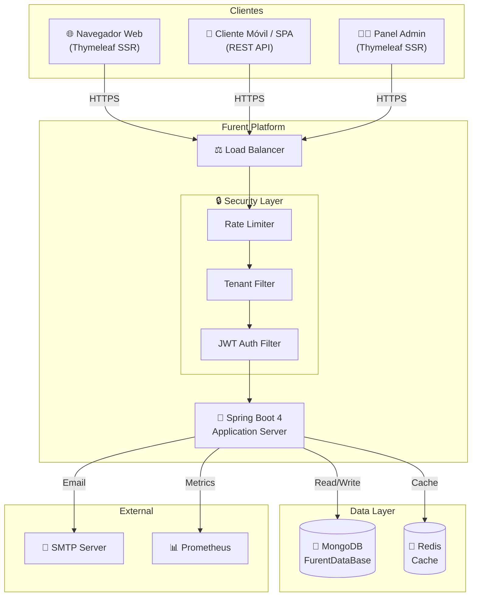
```mermaid
graph TB
    subgraph Clientes
        Browser["🌐 Navegador Web<br/>(Thymeleaf SSR)"]
        Mobile["📱 Cliente Móvil / SPA<br/>(REST API)"]
        Admin["👨‍💼 Panel Admin<br/>(Thymeleaf SSR)"]
    end

    subgraph "Furent Platform"
        LB["⚖️ Load Balancer"]
        API["🚀 Spring Boot 4<br/>Application Server"]
        
        subgraph Security["🔒 Security Layer"]
            RL["Rate Limiter"]
            TF["Tenant Filter"]
            JWT["JWT Auth Filter"]
        end
    end

    subgraph "Data Layer"
        Mongo[("🍃 MongoDB<br/>FurentDataBase")]
        Redis[("🔴 Redis<br/>Cache")]
    end

    subgraph "External"
        SMTP["📧 SMTP Server"]
        Prometheus["📊 Prometheus"]
    end

    Browser -->|HTTPS| LB
    Mobile -->|HTTPS| LB
    Admin -->|HTTPS| LB
    LB --> RL
    RL --> TF
    TF --> JWT
    JWT --> API
    API -->|Read/Write| Mongo
    API -->|Cache| Redis
    API -->|Email| SMTP
    API -->|Metrics| Prometheus
```

---

## 2. Diagrama de Arquitectura por Capas

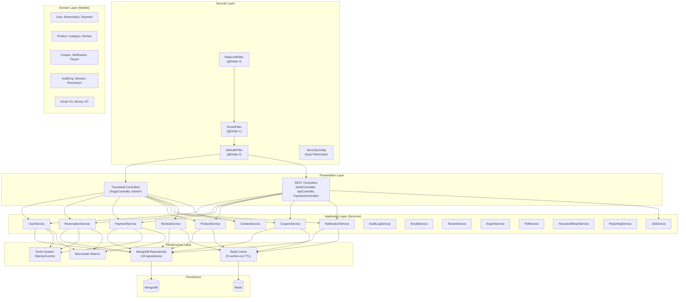
```mermaid
graph TB
    subgraph "Presentation Layer"
        direction LR
        TC["Thymeleaf Controllers<br/>(PageController, Admin*)"]
        RC["REST Controllers<br/>(AuthController, ApiController,<br/>PaymentController)"]
    end

    subgraph "Security Layer"
        direction LR
        RLF["RateLimitFilter<br/>(@Order 0)"]
        TNF["TenantFilter<br/>(@Order 1)"]
        JWF["JwtAuthFilter<br/>(@Order 2)"]
        SC["SecurityConfig<br/>(Dual FilterChain)"]
    end

    subgraph "Application Layer (Services)"
        direction LR
        US["UserService"]
        RS["ReservationService"]
        PS["PaymentService"]
        PrS["ProductService"]
        CS["CouponService"]
        NS["NotificationService"]
        RvS["ReviewService"]
        JS["JwtService"]
        AS["AuditLogService"]
        ES["EmailService"]
        TS["TenantService"]
        ExS["ExportService"]
        PdS["PdfService"]
        PRS["PasswordResetService"]
        RpS["ReportingService"]
        CoS["ContactService"]
    end

    subgraph "Domain Layer (Models)"
        direction LR
        M1["User, Reservation, Payment"]
        M2["Product, Category, Review"]
        M3["Coupon, Notification, Tenant"]
        M4["AuditLog, Session, Permission"]
        M5["Email VO, Money VO"]
    end

    subgraph "Infrastructure Layer"
        direction LR
        REPO["MongoDB Repositories<br/>(18 repositories)"]
        CACHE["Redis Cache<br/>(9 caches con TTL)"]
        EVT["Event System<br/>(Spring Events)"]
        MET["Micrometer Metrics"]
    end

    subgraph "Persistence"
        MONGODB[("MongoDB")]
        REDIS[("Redis")]
    end

    TC --> US & RS & PS & PrS & CS & NS & RvS & CoS
    RC --> US & RS & PS & PrS & CS & NS & JS

    RLF --> TNF --> JWF --> TC & RC

    US & RS & PS & PrS & CS & NS & RvS --> REPO
    PrS & CS & NS & RvS --> CACHE
    RS & PS & US --> EVT
    RS & PS & US --> MET

    REPO --> MONGODB
    CACHE --> REDIS
```

---

## 3. Diagrama de Componentes

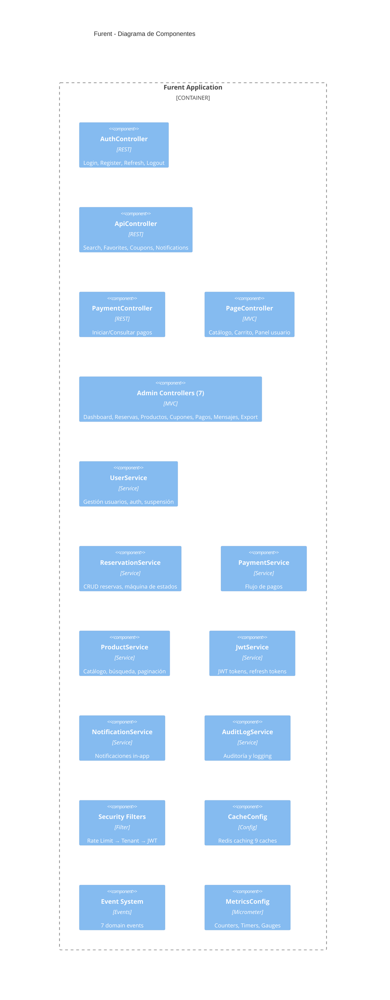
```mermaid
C4Component
    title Furent - Diagrama de Componentes

    Container_Boundary(app, "Furent Application") {
        Component(auth, "AuthController", "REST", "Login, Register, Refresh, Logout")
        Component(api, "ApiController", "REST", "Search, Favorites, Coupons, Notifications")
        Component(pay, "PaymentController", "REST", "Iniciar/Consultar pagos")
        Component(page, "PageController", "MVC", "Catálogo, Carrito, Panel usuario")
        Component(admin, "Admin Controllers (7)", "MVC", "Dashboard, Reservas, Productos, Cupones, Pagos, Mensajes, Export")

        Component(userSvc, "UserService", "Service", "Gestión usuarios, auth, suspensión")
        Component(resSvc, "ReservationService", "Service", "CRUD reservas, máquina de estados")
        Component(paySvc, "PaymentService", "Service", "Flujo de pagos")
        Component(prodSvc, "ProductService", "Service", "Catálogo, búsqueda, paginación")
        Component(jwtSvc, "JwtService", "Service", "JWT tokens, refresh tokens")
        Component(notifSvc, "NotificationService", "Service", "Notificaciones in-app")
        Component(auditSvc, "AuditLogService", "Service", "Auditoría y logging")

        Component(security, "Security Filters", "Filter", "Rate Limit → Tenant → JWT")
        Component(cache, "CacheConfig", "Config", "Redis caching 9 caches")
        Component(events, "Event System", "Events", "7 domain events")
        Component(metrics, "MetricsConfig", "Micrometer", "Counters, Timers, Gauges")
    }
```

---

## 4. Modelo de Dominio (UML)

### 4.1 Diagrama de Clases — Entidades Principales

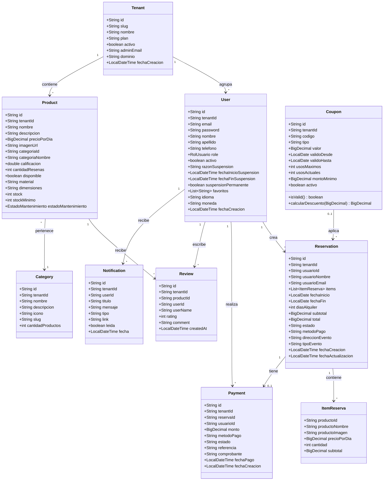
```mermaid
classDiagram
    class User {
        +String id
        +String tenantId
        +String email
        +String password
        +String nombre
        +String apellido
        +String telefono
        +RolUsuario role
        +boolean activo
        +String razonSuspension
        +LocalDateTime fechaInicioSuspension
        +LocalDateTime fechaFinSuspension
        +boolean suspensionPermanente
        +List~String~ favoritos
        +String idioma
        +String moneda
        +LocalDateTime fechaCreacion
    }

    class Reservation {
        +String id
        +String tenantId
        +String usuarioId
        +String usuarioNombre
        +String usuarioEmail
        +List~ItemReserva~ items
        +LocalDate fechaInicio
        +LocalDate fechaFin
        +int diasAlquiler
        +BigDecimal subtotal
        +BigDecimal total
        +String estado
        +String metodoPago
        +String direccionEvento
        +String tipoEvento
        +LocalDateTime fechaCreacion
        +LocalDateTime fechaActualizacion
    }

    class ItemReserva {
        +String productoId
        +String productoNombre
        +String productoImagen
        +BigDecimal precioPorDia
        +int cantidad
        +BigDecimal subtotal
    }

    class Payment {
        +String id
        +String tenantId
        +String reservaId
        +String usuarioId
        +BigDecimal monto
        +String metodoPago
        +String estado
        +String referencia
        +String comprobante
        +LocalDateTime fechaPago
        +LocalDateTime fechaCreacion
    }

    class Product {
        +String id
        +String tenantId
        +String nombre
        +String descripcion
        +BigDecimal precioPorDia
        +String imagenUrl
        +String categoriaId
        +String categoriaNombre
        +double calificacion
        +int cantidadResenas
        +boolean disponible
        +String material
        +String dimensiones
        +int stock
        +int stockMinimo
        +EstadoMantenimiento estadoMantenimiento
    }

    class Category {
        +String id
        +String tenantId
        +String nombre
        +String descripcion
        +String icono
        +String slug
        +int cantidadProductos
    }

    class Review {
        +String id
        +String tenantId
        +String productId
        +String userId
        +String userName
        +int rating
        +String comment
        +LocalDateTime createdAt
    }

    class Coupon {
        +String id
        +String tenantId
        +String codigo
        +String tipo
        +BigDecimal valor
        +LocalDate validoDesde
        +LocalDate validoHasta
        +int usosMaximos
        +int usosActuales
        +BigDecimal montoMinimo
        +boolean activo
        +isValid() boolean
        +calcularDescuento(BigDecimal) BigDecimal
    }

    class Notification {
        +String id
        +String tenantId
        +String userId
        +String titulo
        +String mensaje
        +String tipo
        +String link
        +boolean leida
        +LocalDateTime fecha
    }

    class Tenant {
        +String id
        +String slug
        +String nombre
        +String plan
        +boolean activo
        +String adminEmail
        +String dominio
        +LocalDateTime fechaCreacion
    }

    User "1" --> "*" Reservation : crea
    User "1" --> "*" Payment : realiza
    User "1" --> "*" Review : escribe
    User "1" --> "*" Notification : recibe
    Reservation "1" --> "*" ItemReserva : contiene
    Reservation "1" --> "0..1" Payment : tiene
    Product "1" --> "*" Review : recibe
    Product "*" --> "1" Category : pertenece
    Coupon "0..1" --> "*" Reservation : aplica
    Tenant "1" --> "*" User : agrupa
    Tenant "1" --> "*" Product : contiene
```

### 4.2 Diagrama de Clases — Seguridad & Tokens

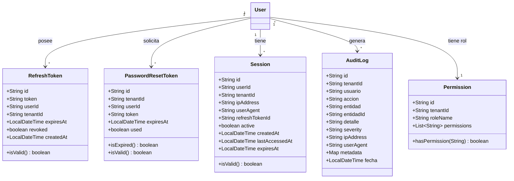
```mermaid
classDiagram
    class RefreshToken {
        +String id
        +String token
        +String userId
        +String tenantId
        +LocalDateTime expiresAt
        +boolean revoked
        +LocalDateTime createdAt
        +isValid() boolean
    }

    class PasswordResetToken {
        +String id
        +String tenantId
        +String userId
        +String token
        +LocalDateTime expiresAt
        +boolean used
        +isExpired() boolean
        +isValid() boolean
    }

    class Session {
        +String id
        +String userId
        +String tenantId
        +String ipAddress
        +String userAgent
        +String refreshTokenId
        +boolean active
        +LocalDateTime createdAt
        +LocalDateTime lastAccessedAt
        +LocalDateTime expiresAt
        +isValid() boolean
    }

    class AuditLog {
        +String id
        +String tenantId
        +String usuario
        +String accion
        +String entidad
        +String entidadId
        +String detalle
        +String severity
        +String ipAddress
        +String userAgent
        +Map metadata
        +LocalDateTime fecha
    }

    class Permission {
        +String id
        +String tenantId
        +String roleName
        +List~String~ permissions
        +hasPermission(String) boolean
    }

    User "1" --> "*" RefreshToken : posee
    User "1" --> "*" PasswordResetToken : solicita
    User "1" --> "*" Session : tiene
    User "1" --> "*" AuditLog : genera
    User "*" --> "1" Permission : tiene rol
```

### 4.3 Value Objects (DDD)

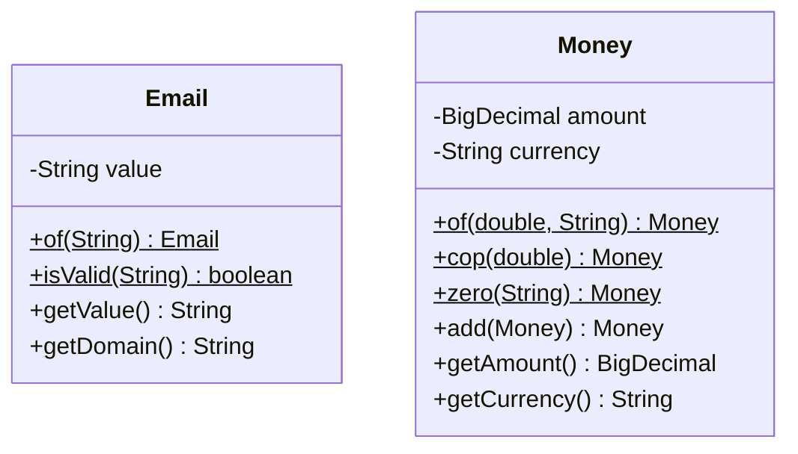
```mermaid
classDiagram
    class Email {
        -String value
        +of(String) Email$
        +isValid(String) boolean$
        +getValue() String
        +getDomain() String
    }

    class Money {
        -BigDecimal amount
        -String currency
        +of(double, String) Money$
        +cop(double) Money$
        +zero(String) Money$
        +add(Money) Money
        +getAmount() BigDecimal
        +getCurrency() String
    }
```

---

## 5. Flujo de Reservas (Máquina de Estados)

### 5.1 Diagrama de Estados

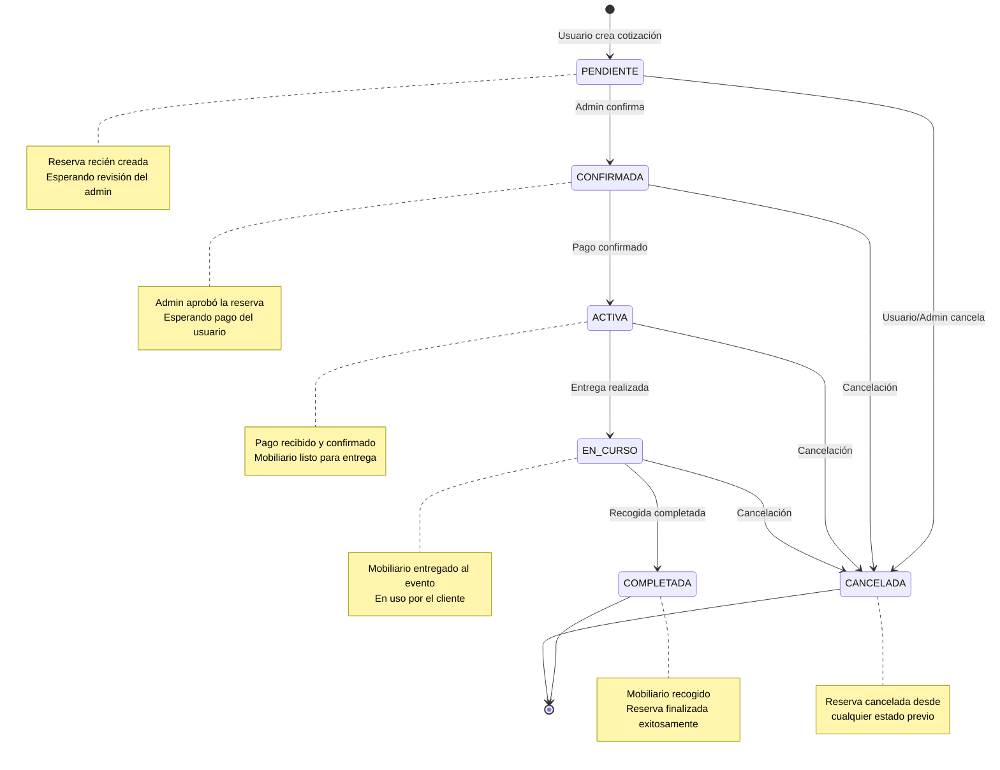
```mermaid
stateDiagram-v2
    [*] --> PENDIENTE : Usuario crea cotización

    PENDIENTE --> CONFIRMADA : Admin confirma
    PENDIENTE --> CANCELADA : Usuario/Admin cancela

    CONFIRMADA --> ACTIVA : Pago confirmado
    CONFIRMADA --> CANCELADA : Cancelación

    ACTIVA --> EN_CURSO : Entrega realizada
    ACTIVA --> CANCELADA : Cancelación

    EN_CURSO --> COMPLETADA : Recogida completada
    EN_CURSO --> CANCELADA : Cancelación

    COMPLETADA --> [*]
    CANCELADA --> [*]

    note right of PENDIENTE
        Reserva recién creada
        Esperando revisión del admin
    end note

    note right of CONFIRMADA
        Admin aprobó la reserva
        Esperando pago del usuario
    end note

    note right of ACTIVA
        Pago recibido y confirmado
        Mobiliario listo para entrega
    end note

    note right of EN_CURSO
        Mobiliario entregado al evento
        En uso por el cliente
    end note

    note right of COMPLETADA
        Mobiliario recogido
        Reserva finalizada exitosamente
    end note

    note right of CANCELADA
        Reserva cancelada desde
        cualquier estado previo
    end note
```

### 5.2 Transiciones Válidas

| Estado Actual | → Transiciones Permitidas |
|:---|:---|
| `PENDIENTE` | → `CONFIRMADA`, `CANCELADA` |
| `CONFIRMADA` | → `ACTIVA`, `CANCELADA` |
| `ACTIVA` | → `EN_CURSO`, `CANCELADA` |
| `EN_CURSO` | → `COMPLETADA`, `CANCELADA` |
| `COMPLETADA` | _(estado final)_ |
| `CANCELADA` | _(estado final)_ |

### 5.3 Flujo Completo de Reserva (Secuencia)

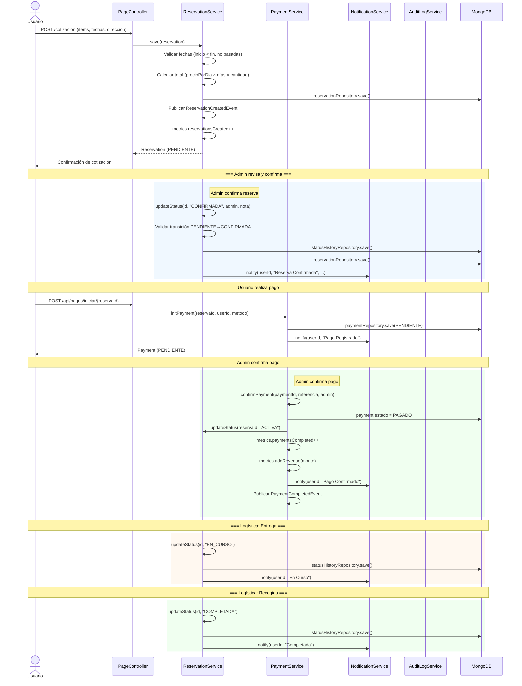
```mermaid
sequenceDiagram
    actor U as Usuario
    participant PC as PageController
    participant RS as ReservationService
    participant PS as PaymentService
    participant NS as NotificationService
    participant AS as AuditLogService
    participant DB as MongoDB

    U->>PC: POST /cotizacion (items, fechas, dirección)
    PC->>RS: save(reservation)
    RS->>RS: Validar fechas (inicio < fin, no pasadas)
    RS->>RS: Calcular total (precioPorDia × días × cantidad)
    RS->>DB: reservationRepository.save()
    RS->>RS: Publicar ReservationCreatedEvent
    RS->>RS: metrics.reservationsCreated++
    RS-->>PC: Reservation (PENDIENTE)
    PC-->>U: Confirmación de cotización

    Note over U,DB: === Admin revisa y confirma ===

    rect rgb(240, 248, 255)
        Note right of RS: Admin confirma reserva
        RS->>RS: updateStatus(id, "CONFIRMADA", admin, nota)
        RS->>RS: Validar transición PENDIENTE→CONFIRMADA
        RS->>DB: statusHistoryRepository.save()
        RS->>DB: reservationRepository.save()
        RS->>NS: notify(userId, "Reserva Confirmada", ...)
    end

    Note over U,DB: === Usuario realiza pago ===

    U->>PC: POST /api/pagos/iniciar/{reservaId}
    PC->>PS: initPayment(reservaId, userId, metodo)
    PS->>DB: paymentRepository.save(PENDIENTE)
    PS->>NS: notify(userId, "Pago Registrado")
    PS-->>U: Payment (PENDIENTE)

    Note over U,DB: === Admin confirma pago ===

    rect rgb(240, 255, 240)
        Note right of PS: Admin confirma pago
        PS->>PS: confirmPayment(paymentId, referencia, admin)
        PS->>DB: payment.estado = PAGADO
        PS->>RS: updateStatus(reservaId, "ACTIVA")
        PS->>PS: metrics.paymentsCompleted++
        PS->>PS: metrics.addRevenue(monto)
        PS->>NS: notify(userId, "Pago Confirmado")
        PS->>PS: Publicar PaymentCompletedEvent
    end

    Note over U,DB: === Logística: Entrega ===

    rect rgb(255, 248, 240)
        RS->>RS: updateStatus(id, "EN_CURSO")
        RS->>DB: statusHistoryRepository.save()
        RS->>NS: notify(userId, "En Curso")
    end

    Note over U,DB: === Logística: Recogida ===

    rect rgb(240, 255, 240)
        RS->>RS: updateStatus(id, "COMPLETADA")
        RS->>DB: statusHistoryRepository.save()
        RS->>NS: notify(userId, "Completada")
    end
```

---

## 6. Flujo de Pagos

### 6.1 Estados del Pago

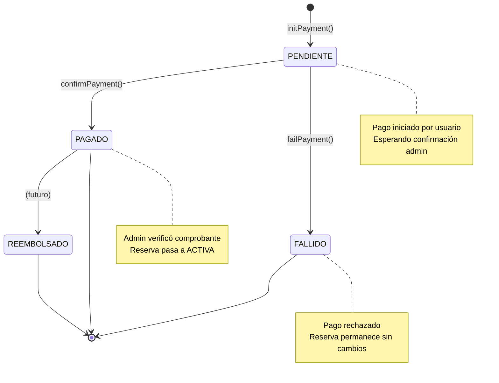
```mermaid
stateDiagram-v2
    [*] --> PENDIENTE : initPayment()

    PENDIENTE --> PAGADO : confirmPayment()
    PENDIENTE --> FALLIDO : failPayment()

    PAGADO --> REEMBOLSADO : (futuro)
    
    PAGADO --> [*]
    FALLIDO --> [*]
    REEMBOLSADO --> [*]

    note right of PENDIENTE
        Pago iniciado por usuario
        Esperando confirmación admin
    end note

    note right of PAGADO
        Admin verificó comprobante
        Reserva pasa a ACTIVA
    end note

    note right of FALLIDO
        Pago rechazado
        Reserva permanece sin cambios
    end note
```

### 6.2 Secuencia de Pago

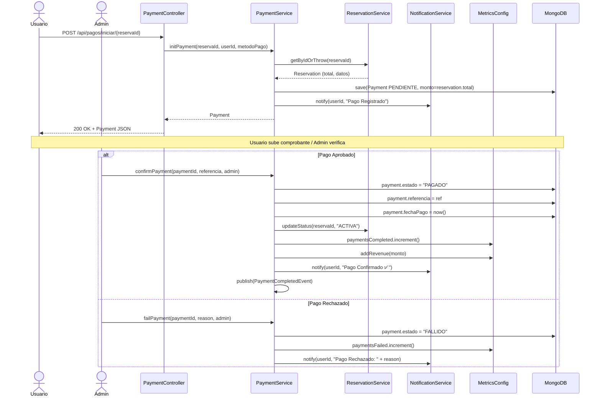
```mermaid
sequenceDiagram
    actor U as Usuario
    actor A as Admin
    participant PC as PaymentController
    participant PS as PaymentService
    participant RS as ReservationService
    participant NS as NotificationService
    participant MC as MetricsConfig
    participant DB as MongoDB

    U->>PC: POST /api/pagos/iniciar/{reservaId}
    PC->>PS: initPayment(reservaId, userId, metodoPago)
    PS->>RS: getByIdOrThrow(reservaId)
    RS-->>PS: Reservation (total, datos)
    PS->>DB: save(Payment PENDIENTE, monto=reservation.total)
    PS->>NS: notify(userId, "Pago Registrado")
    PS-->>PC: Payment
    PC-->>U: 200 OK + Payment JSON

    Note over U,DB: Usuario sube comprobante / Admin verifica

    alt Pago Aprobado
        A->>PS: confirmPayment(paymentId, referencia, admin)
        PS->>DB: payment.estado = "PAGADO"
        PS->>DB: payment.referencia = ref
        PS->>DB: payment.fechaPago = now()
        PS->>RS: updateStatus(reservaId, "ACTIVA")
        PS->>MC: paymentsCompleted.increment()
        PS->>MC: addRevenue(monto)
        PS->>NS: notify(userId, "Pago Confirmado ✅")
        PS->>PS: publish(PaymentCompletedEvent)
    else Pago Rechazado
        A->>PS: failPayment(paymentId, reason, admin)
        PS->>DB: payment.estado = "FALLIDO"
        PS->>MC: paymentsFailed.increment()
        PS->>NS: notify(userId, "Pago Rechazado: " + reason)
    end
```

---

## 7. Flujo de Autenticación JWT

### 7.1 Login y Emisión de Tokens

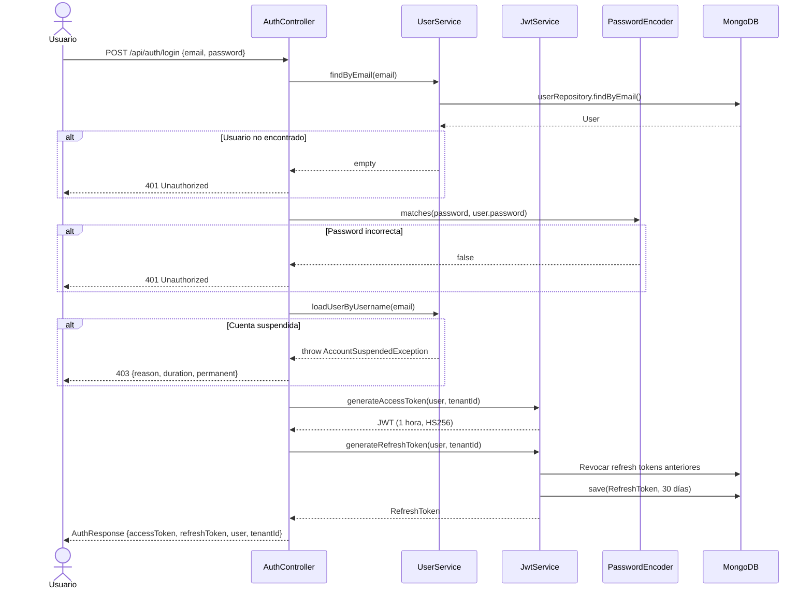
```mermaid
sequenceDiagram
    actor U as Usuario
    participant AC as AuthController
    participant US as UserService
    participant JS as JwtService
    participant PE as PasswordEncoder
    participant DB as MongoDB

    U->>AC: POST /api/auth/login {email, password}
    AC->>US: findByEmail(email)
    US->>DB: userRepository.findByEmail()
    DB-->>US: User

    alt Usuario no encontrado
        US-->>AC: empty
        AC-->>U: 401 Unauthorized
    end

    AC->>PE: matches(password, user.password)
    
    alt Password incorrecta
        PE-->>AC: false
        AC-->>U: 401 Unauthorized
    end

    AC->>US: loadUserByUsername(email)
    
    alt Cuenta suspendida
        US-->>AC: throw AccountSuspendedException
        AC-->>U: 403 {reason, duration, permanent}
    end

    AC->>JS: generateAccessToken(user, tenantId)
    JS-->>AC: JWT (1 hora, HS256)
    
    AC->>JS: generateRefreshToken(user, tenantId)
    JS->>DB: Revocar refresh tokens anteriores
    JS->>DB: save(RefreshToken, 30 días)
    JS-->>AC: RefreshToken

    AC-->>U: AuthResponse {accessToken, refreshToken, user, tenantId}
```

### 7.2 Validación JWT en cada Request

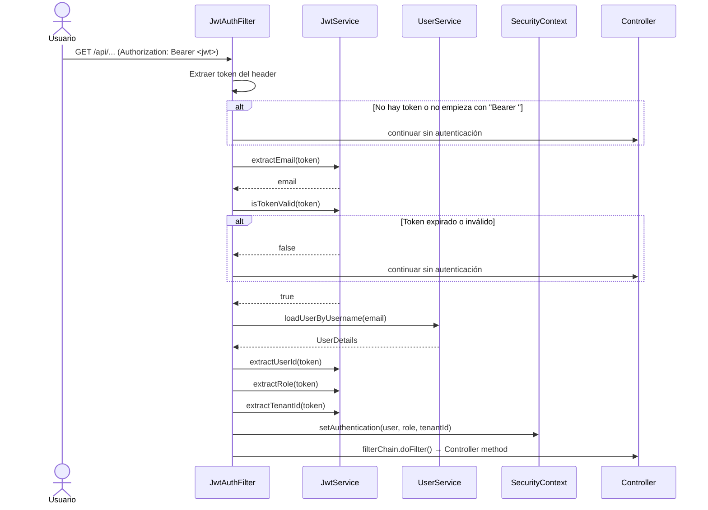
```mermaid
sequenceDiagram
    actor U as Usuario
    participant JF as JwtAuthFilter
    participant JS as JwtService
    participant US as UserService
    participant SC as SecurityContext
    participant C as Controller

    U->>JF: GET /api/... (Authorization: Bearer <jwt>)
    JF->>JF: Extraer token del header
    
    alt No hay token o no empieza con "Bearer "
        JF->>C: continuar sin autenticación
    end

    JF->>JS: extractEmail(token)
    JS-->>JF: email
    
    JF->>JS: isTokenValid(token)
    
    alt Token expirado o inválido
        JS-->>JF: false
        JF->>C: continuar sin autenticación
    end
    
    JS-->>JF: true
    JF->>US: loadUserByUsername(email)
    US-->>JF: UserDetails
    
    JF->>JS: extractUserId(token)
    JF->>JS: extractRole(token)
    JF->>JS: extractTenantId(token)
    
    JF->>SC: setAuthentication(user, role, tenantId)
    JF->>C: filterChain.doFilter() → Controller method
```

### 7.3 Refresh Token Flow

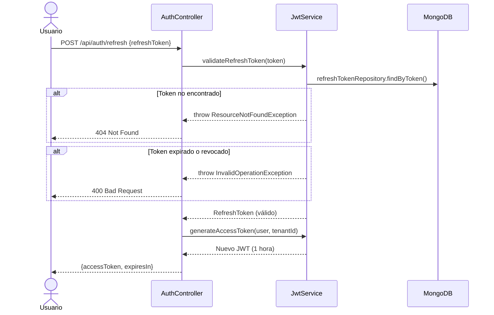
```mermaid
sequenceDiagram
    actor U as Usuario
    participant AC as AuthController
    participant JS as JwtService
    participant DB as MongoDB

    U->>AC: POST /api/auth/refresh {refreshToken}
    AC->>JS: validateRefreshToken(token)
    JS->>DB: refreshTokenRepository.findByToken()
    
    alt Token no encontrado
        JS-->>AC: throw ResourceNotFoundException
        AC-->>U: 404 Not Found
    end

    alt Token expirado o revocado
        JS-->>AC: throw InvalidOperationException
        AC-->>U: 400 Bad Request
    end

    JS-->>AC: RefreshToken (válido)
    AC->>JS: generateAccessToken(user, tenantId)
    JS-->>AC: Nuevo JWT (1 hora)
    AC-->>U: {accessToken, expiresIn}
```

---

## 8. Pipeline de Seguridad

### 8.1 Cadena de Filtros

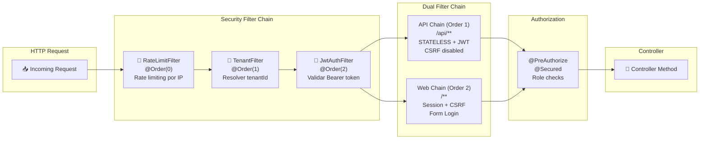
```mermaid
graph LR
    subgraph "HTTP Request"
        REQ["📥 Incoming Request"]
    end

    subgraph "Security Filter Chain"
        direction LR
        F1["🛑 RateLimitFilter<br/>@Order(0)<br/>Rate limiting por IP"]
        F2["🏢 TenantFilter<br/>@Order(1)<br/>Resolver tenantId"]
        F3["🔑 JwtAuthFilter<br/>@Order(2)<br/>Validar Bearer token"]
    end

    subgraph "Dual Filter Chain"
        direction TB
        API["API Chain (Order 1)<br/>/api/**<br/>STATELESS + JWT<br/>CSRF disabled"]
        WEB["Web Chain (Order 2)<br/>/**<br/>Session + CSRF<br/>Form Login"]
    end

    subgraph "Authorization"
        AUTH["@PreAuthorize<br/>@Secured<br/>Role checks"]
    end

    subgraph "Controller"
        CTRL["🎯 Controller Method"]
    end

    REQ --> F1 --> F2 --> F3
    F3 --> API
    F3 --> WEB
    API --> AUTH
    WEB --> AUTH
    AUTH --> CTRL
```

### 8.2 Configuración Dual FilterChain

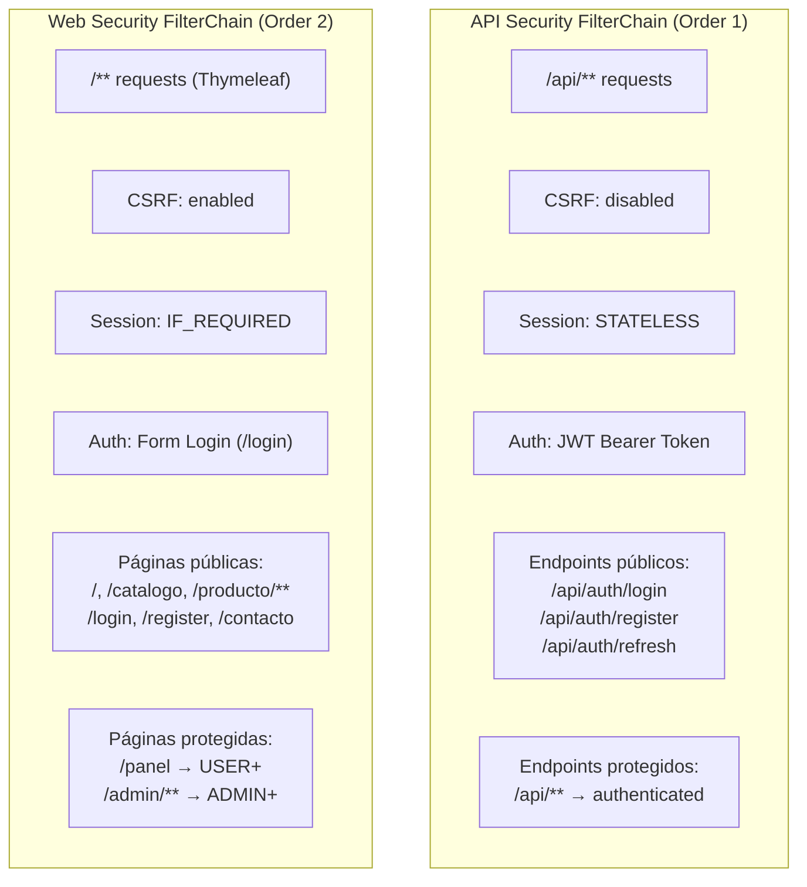
```mermaid
graph TB
    subgraph "API Security FilterChain (Order 1)"
        A1["/api/** requests"]
        A2["CSRF: disabled"]
        A3["Session: STATELESS"]
        A4["Auth: JWT Bearer Token"]
        A5["Endpoints públicos:<br/>/api/auth/login<br/>/api/auth/register<br/>/api/auth/refresh"]
        A6["Endpoints protegidos:<br/>/api/** → authenticated"]
    end

    subgraph "Web Security FilterChain (Order 2)"
        W1["/** requests (Thymeleaf)"]
        W2["CSRF: enabled"]
        W3["Session: IF_REQUIRED"]
        W4["Auth: Form Login (/login)"]
        W5["Páginas públicas:<br/>/, /catalogo, /producto/**<br/>/login, /register, /contacto"]
        W6["Páginas protegidas:<br/>/panel → USER+<br/>/admin/** → ADMIN+"]
    end
```

---

## 9. Rate Limiting & Brute Force Protection

### 9.1 Flujo del Rate Limiter

```mermaid
flowchart TD
    A["📥 Request entrante"] --> B{Ruta estática?<br/>/css, /js, /images}
    B -->|Sí| PASS["✅ Pasar sin límite"]
    B -->|No| C["Obtener IP del cliente<br/>(X-Forwarded-For o RemoteAddr)"]
    
    C --> D{¿Qué tipo<br/>de endpoint?}
    
    D -->|POST /api/auth/login| E["Bucket: IP:login<br/>Límite: 5/min"]
    D -->|POST /api/auth/register| F["Bucket: IP:register<br/>Límite: 3/min"]
    D -->|/api/auth/*| G["Bucket: IP:auth<br/>Límite: 10/min"]
    D -->|/api/* (otro)| H["Bucket: IP:general<br/>Límite: 100/min"]
    
    E & F & G & H --> I{Ventana de 60s<br/>expirada?}
    I -->|Sí| J["Reset contador = 1"]
    I -->|No| K["contador++"]
    
    J & K --> L{contador > límite?}
    
    L -->|No| M["✅ Pasar request<br/>Headers:<br/>X-RateLimit-Limit<br/>X-RateLimit-Remaining"]
    
    L -->|Sí| N{¿Es login<br/>brute force?}
    N -->|Sí| O["🔴 Log BRUTE_FORCE_BLOCKED<br/>AuditLogService.logSecurity()"]
    N -->|No| P["⚠️ Log rate limit exceeded"]
    
    O & P --> Q["🚫 429 Too Many Requests<br/>Retry-After: 60<br/>JSON error response"]

    style Q fill:#ff6b6b,color:#fff
    style PASS fill:#51cf66,color:#fff
    style M fill:#51cf66,color:#fff
    style O fill:#ff6b6b,color:#fff
```

### 9.2 Límites Configurados

| Endpoint | Límite | Bucket Key | Propósito |
|:---|:---|:---|:---|
| `POST /api/auth/login` | 5/min | `IP:login` | Protección brute force |
| `POST /api/auth/register` | 3/min | `IP:register` | Prevenir spam de registros |
| `/api/auth/*` | 10/min | `IP:auth` | Límite general auth |
| `/api/*` | 100/min | `IP:general` | Protección DoS general |

---

## 10. Caching con Redis

### 10.1 Estrategia de Cache

```mermaid
graph TB
    subgraph "Cache Layer (Redis)"
        C1["products<br/>TTL: 10 min"]
        C2["categories<br/>TTL: 30 min"]
        C3["product-detail<br/>TTL: 5 min<br/>Key: #id"]
        C4["featured-products<br/>TTL: 10 min"]
        C5["tenant-config<br/>TTL: 15 min"]
        C6["user-profile<br/>TTL: 5 min"]
        C7["notifications<br/>TTL: 2 min<br/>Key: #userId"]
        C8["reviews<br/>TTL: 5 min<br/>Key: #productId"]
        C9["coupons<br/>TTL: 15 min"]
    end

    subgraph "Services"
        PS["ProductService"] -->|@Cacheable| C1 & C2 & C3 & C4
        TS["TenantService"] -->|@Cacheable| C5
        US["UserService"] -->|@Cacheable| C6
        NS["NotificationService"] -->|@Cacheable| C7
        RS["ReviewService"] -->|@Cacheable| C8
        CS["CouponService"] -->|@Cacheable| C9
    end

    subgraph "Invalidation (@CacheEvict)"
        E1["Nuevo producto → evict products, categories, featured"]
        E2["Nueva review → evict reviews(productId)"]
        E3["Nuevo cupón → evict coupons"]
        E4["Marcar notif leída → evict notifications(userId)"]
    end
```

### 10.2 Patrón Cache-Aside

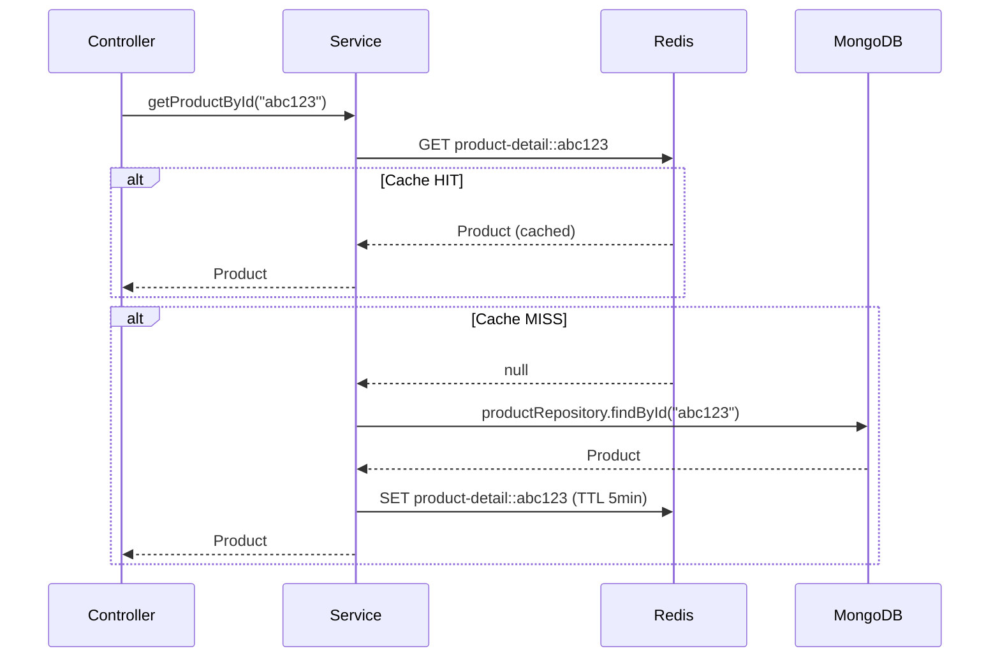
```mermaid
sequenceDiagram
    participant C as Controller
    participant S as Service
    participant R as Redis
    participant DB as MongoDB

    C->>S: getProductById("abc123")
    S->>R: GET product-detail::abc123
    
    alt Cache HIT
        R-->>S: Product (cached)
        S-->>C: Product
    end

    alt Cache MISS
        R-->>S: null
        S->>DB: productRepository.findById("abc123")
        DB-->>S: Product
        S->>R: SET product-detail::abc123 (TTL 5min)
        S-->>C: Product
    end
```

---

## 11. Sistema de Eventos

### 11.1 Eventos de Dominio

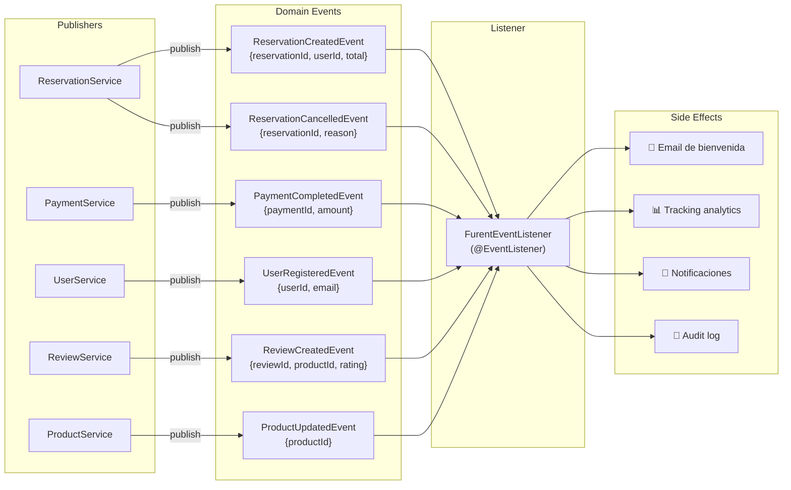
```mermaid
graph LR
    subgraph "Publishers"
        RS["ReservationService"]
        PS["PaymentService"]
        US["UserService"]
        RvS["ReviewService"]
        PrS["ProductService"]
    end

    subgraph "Domain Events"
        E1["ReservationCreatedEvent<br/>{reservationId, userId, total}"]
        E2["ReservationCancelledEvent<br/>{reservationId, reason}"]
        E3["PaymentCompletedEvent<br/>{paymentId, amount}"]
        E4["UserRegisteredEvent<br/>{userId, email}"]
        E5["ReviewCreatedEvent<br/>{reviewId, productId, rating}"]
        E6["ProductUpdatedEvent<br/>{productId}"]
    end

    subgraph "Listener"
        FL["FurentEventListener<br/>(@EventListener)"]
    end

    subgraph "Side Effects"
        SE1["📧 Email de bienvenida"]
        SE2["📊 Tracking analytics"]
        SE3["🔔 Notificaciones"]
        SE4["📝 Audit log"]
    end

    RS -->|publish| E1 & E2
    PS -->|publish| E3
    US -->|publish| E4
    RvS -->|publish| E5
    PrS -->|publish| E6

    E1 & E2 & E3 & E4 & E5 & E6 --> FL
    FL --> SE1 & SE2 & SE3 & SE4
```

---

## 12. Arquitectura Multi-Tenant

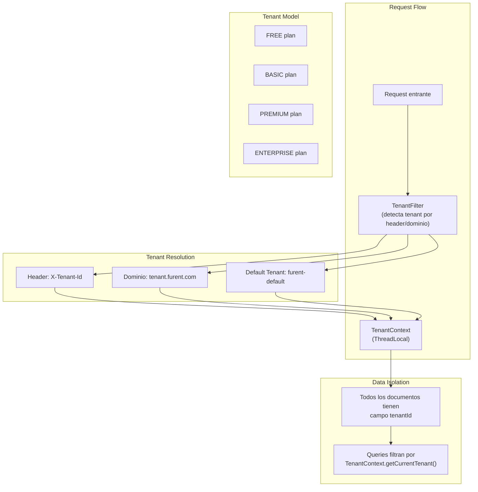
```mermaid
graph TB
    subgraph "Request Flow"
        REQ["Request entrante"]
        TF["TenantFilter<br/>(detecta tenant por header/dominio)"]
        TC["TenantContext<br/>(ThreadLocal)"]
    end

    subgraph "Tenant Resolution"
        H1["Header: X-Tenant-Id"]
        H2["Dominio: tenant.furent.com"]
        H3["Default Tenant: furent-default"]
    end

    subgraph "Data Isolation"
        D1["Todos los documentos tienen<br/>campo tenantId"]
        D2["Queries filtran por<br/>TenantContext.getCurrentTenant()"]
    end

    subgraph "Tenant Model"
        T1["FREE plan"]
        T2["BASIC plan"]
        T3["PREMIUM plan"]
        T4["ENTERPRISE plan"]
    end

    REQ --> TF
    TF --> H1 & H2 & H3
    H1 & H2 & H3 --> TC
    TC --> D1
    D1 --> D2
```

---

## 13. Estructura de Paquetes

```
com.alquiler.furent/
├── FurentApplication.java              # Spring Boot main
│
├── controller/                         # Capa de presentación
│   ├── AuthController.java             # REST: Login, Register, Refresh, Logout
│   ├── ApiController.java              # REST: Search, Favourites, Coupons, Notifications
│   ├── PaymentController.java          # REST: Payment operations
│   ├── PageController.java             # MVC: Thymeleaf pages
│   ├── ReviewController.java           # MVC: Submit reviews
│   └── admin/                          # MVC: Admin panel
│       ├── AdminDashboardController    # Dashboard KPIs
│       ├── AdminProductosController    # CRUD productos
│       ├── AdminReservasController     # Gestión reservas + PDF
│       ├── AdminCuponesController      # CRUD cupones
│       ├── AdminPagosController        # Confirmar/listar pagos
│       ├── AdminMensajesController     # Mensajes de contacto
│       ├── AdminExportController       # Exportar CSV
│       └── AdminModelAdvice            # Global model attributes
│
├── service/                            # Capa de lógica de negocio
│   ├── UserService.java                # Auth, CRUD users, suspensión
│   ├── ReservationService.java         # Reservas, estado machine, métricas
│   ├── PaymentService.java             # Flujo de pagos
│   ├── ProductService.java             # Catálogo, búsqueda, caché
│   ├── CouponService.java              # Validación y aplicación cupones
│   ├── NotificationService.java        # Notificaciones in-app
│   ├── ReviewService.java              # Reseñas de productos
│   ├── JwtService.java                 # JWT tokens + refresh tokens
│   ├── AuditLogService.java            # Auditoría y logging
│   ├── ContactService.java             # Mensajes de contacto
│   ├── EmailService.java               # Envío de emails (SMTP)
│   ├── PasswordResetService.java       # Recuperación de contraseña
│   ├── PdfService.java                 # Generación de PDFs
│   ├── ExportService.java              # Exportación CSV
│   ├── TenantService.java              # Gestión multi-tenant
│   └── ReportingService.java           # Analytics y reportes
│
├── repository/                         # Capa de acceso a datos (MongoDB)
│   ├── UserRepository.java
│   ├── ReservationRepository.java
│   ├── PaymentRepository.java
│   ├── ProductRepository.java
│   ├── CategoryRepository.java
│   ├── ReviewRepository.java
│   ├── CouponRepository.java
│   ├── NotificationRepository.java
│   ├── AuditLogRepository.java
│   ├── ContactMessageRepository.java
│   ├── PasswordResetTokenRepository.java
│   ├── RefreshTokenRepository.java
│   ├── TenantRepository.java
│   ├── SessionRepository.java
│   ├── StatusHistoryRepository.java
│   ├── AnalyticsEventRepository.java
│   ├── ReportCacheRepository.java
│   └── PermissionRepository.java
│
├── model/                              # Entidades de dominio (MongoDB @Document)
│   ├── User.java                       # Usuario con roles y suspensión
│   ├── Reservation.java                # Reserva con items y estados
│   ├── Payment.java                    # Pago vinculado a reserva
│   ├── Product.java                    # Mobiliario para alquiler
│   ├── Category.java                   # Categorías de productos
│   ├── Review.java                     # Reseñas de productos
│   ├── Coupon.java                     # Cupones de descuento
│   ├── Notification.java               # Notificaciones del sistema
│   ├── ContactMessage.java             # Mensajes del formulario
│   ├── AuditLog.java                   # Registro de auditoría
│   ├── PasswordResetToken.java         # Token de reset password
│   ├── RefreshToken.java               # Refresh token JWT
│   ├── Session.java                    # Sesión de usuario
│   ├── Tenant.java                     # Tenant SaaS
│   ├── Permission.java                 # Permisos por rol
│   ├── StatusHistory.java              # Historial de estados
│   ├── AnalyticsEvent.java             # Eventos analytics
│   ├── ReportCache.java                # Cache de reportes
│   ├── Email.java                      # Value Object (DDD)
│   └── Money.java                      # Value Object (DDD)
│
├── dto/                                # Data Transfer Objects
│   ├── AuthResponse.java               # Respuesta de login (record)
│   ├── UserResponse.java               # Info pública de usuario (record)
│   ├── ProductResponse.java            # Producto resumido (record)
│   ├── ReservationResponse.java        # Reserva + items (record)
│   ├── TenantResponse.java             # Tenant público (record)
│   ├── LoginRequest.java               # Request de login
│   └── CotizacionRequest.java          # Request de cotización + CartItem
│
├── exception/                          # Manejo de errores
│   ├── ResourceNotFoundException.java  # 404
│   ├── DuplicateResourceException.java # 409
│   ├── InvalidOperationException.java  # 400
│   ├── AccountSuspendedException.java  # 403 (con metadatos)
│   ├── TooManyRequestsException.java   # 429
│   ├── GlobalExceptionHandler.java     # @ControllerAdvice (Thymeleaf)
│   └── ApiExceptionHandler.java        # @RestControllerAdvice (API JSON)
│
├── enums/                              # Enumeraciones
│   ├── EstadoReserva.java              # PENDIENTE → COMPLETADA/CANCELADA
│   ├── EstadoPago.java                 # PENDIENTE → PAGADO/FALLIDO/REEMBOLSADO
│   ├── MetodoPago.java                 # TRANSFERENCIA, NEQUI, DAVIPLATA, etc.
│   ├── RolUsuario.java                 # USER, MANAGER, ADMIN, SUPER_ADMIN
│   └── EstadoMantenimiento.java        # EXCELENTE, BUENO, REGULAR, EN_REPARACION
│
├── event/                              # Eventos de dominio (Spring Events)
│   ├── FurentEvent.java                # Evento base
│   ├── UserRegisteredEvent.java
│   ├── ReservationCreatedEvent.java
│   ├── ReservationCancelledEvent.java
│   ├── PaymentCompletedEvent.java
│   ├── ReviewCreatedEvent.java
│   ├── ProductUpdatedEvent.java
│   ├── EventPublisher.java             # Wrapper de ApplicationEventPublisher
│   └── FurentEventListener.java        # @EventListener dispatcher
│
└── config/                             # Configuración
    ├── SecurityConfig.java             # Spring Security (Dual FilterChain)
    ├── JwtAuthFilter.java              # JWT validation filter
    ├── RateLimitFilter.java            # Rate limiting + brute force
    ├── TenantFilter.java               # Multi-tenant context
    ├── CacheConfig.java                # Redis caching (9 caches)
    ├── CorsConfig.java                 # CORS configuration
    ├── MetricsConfig.java              # Micrometer metrics
    ├── FeatureFlags.java               # Feature toggles
    ├── FurentProperties.java           # Custom properties
    ├── TenantContext.java              # ThreadLocal tenant
    ├── WebMvcConfig.java               # MVC config
    ├── GlobalModelAdvice.java          # Global model attributes
    ├── OpenApiConfig.java              # Swagger/OpenAPI
    └── MongoIndexConfig.java           # MongoDB index creation
```

---

## 14. Stack Tecnológico

```mermaid
graph TB
    subgraph "Frontend"
        TH["Thymeleaf 4.0"]
        TW["Tailwind CSS"]
        JS["JavaScript (Vanilla)"]
    end

    subgraph "Backend"
        SB["Spring Boot 4.0.3"]
        SS["Spring Security 7.0"]
        SD["Spring Data MongoDB"]
        SC["Spring Cache (Redis)"]
        SM["Spring Mail (SMTP)"]
    end

    subgraph "Infrastructure"
        MG["MongoDB 7+"]
        RD["Redis 7+"]
        DK["Docker + Docker Compose"]
        K8["Kubernetes (Helm)"]
        PM["Prometheus + Micrometer"]
    end

    subgraph "Libraries"
        JWT["jjwt 0.12.6 (JWT)"]
        BC["BCrypt (Password hashing)"]
        OH["OpenHTMLtoPDF (PDFs)"]
        SD2["springdoc-openapi 2.8.6"]
        JC["JaCoCo 0.8.12 (Coverage)"]
    end

    TH --> SB
    SB --> SS & SD & SC & SM
    SD --> MG
    SC --> RD
    SB --> JWT & BC & OH & SD2
    SB --> PM
    SB --> DK --> K8
```

### Versiones Clave

| Componente | Versión |
|:---|:---|
| Java | 23 (runtime) / 17 (compilation target) |
| Spring Boot | 4.0.3 |
| Spring Framework | 7.0.5 |
| Spring Security | 7.0+ |
| MongoDB | 7+ |
| Redis | 7+ |
| jjwt (JWT) | 0.12.6 |
| springdoc-openapi | 2.8.6 |
| Micrometer | Built-in (SB4) |
| JaCoCo | 0.8.12 |
| OpenHTMLtoPDF | 1.0.10 |

---

## 15. Índices MongoDB

### Índices Configurados

| Colección | Campo(s) | Tipo | Propósito |
|:---|:---|:---|:---|
| **reservations** | `tenantId, usuarioId` | Compound | Reservas por tenant+usuario |
| **reservations** | `tenantId, estado` | Compound | Reservas por tenant+estado |
| **reservations** | `usuarioId, estado` | Compound | Reservas por usuario+estado |
| **reservations** | `usuarioId` | Single | Búsqueda por usuario |
| **reservations** | `estado` | Single | Filtro por estado |
| **reservations** | `fechaCreacion` | Single | Ordenamiento temporal |
| **payments** | `reservaId` | Single | Pago por reserva |
| **payments** | `usuarioId` | Single | Pagos por usuario |
| **notifications** | `userId, leida, fecha` | Compound (desc) | No leídas recientes |
| **notifications** | `userId` | Single | Notificaciones de usuario |
| **reviews** | `productId` | Single | Reseñas por producto |
| **coupons** | `codigo` | Unique | Búsqueda por código (único) |

---

## 16. Métricas & Observabilidad

### 16.1 Métricas Micrometer

```mermaid
graph LR
    subgraph "Counters"
        C1["furent.reservations.created"]
        C2["furent.reservations.cancelled"]
        C3["furent.payments.completed"]
        C4["furent.payments.failed"]
        C5["furent.users.registered"]
        C6["furent.reviews.created"]
    end

    subgraph "Timers"
        T1["furent.reservation.processing.time"]
        T2["furent.payment.processing.time"]
    end

    subgraph "Gauges"
        G1["furent.revenue.total"]
    end

    subgraph "Endpoints"
        E1["GET /actuator/prometheus"]
        E2["GET /actuator/metrics"]
    end

    C1 & C2 & C3 & C4 & C5 & C6 --> E1 & E2
    T1 & T2 --> E1 & E2
    G1 --> E1 & E2
```

### 16.2 Auditoría

Todas las acciones críticas se registran en `AuditLog`:

| Acción | Ejemplo |
|:---|:---|
| `USER_REGISTERED` | Nuevo registro de usuario |
| `LOGIN_SUCCESS` | Login exitoso |
| `RESERVATION_CREATED` | Nueva reserva |
| `STATUS_CHANGED` | Cambio de estado de reserva |
| `PAYMENT_CONFIRMED` | Pago confirmado |
| `BRUTE_FORCE_BLOCKED` | Intento de fuerza bruta bloqueado |

---

## 17. Manejo de Errores

### 17.1 Flujo de Errores

```mermaid
flowchart TD
    E["Exception lanzada"] --> T{¿Request tipo?}
    
    T -->|/api/**| API["ApiExceptionHandler<br/>(@RestControllerAdvice)"]
    T -->|/**| MVC["GlobalExceptionHandler<br/>(@ControllerAdvice)"]
    
    API --> J["JSON Response"]
    MVC --> H["HTML Error Page"]
    
    subgraph "API Error Response (JSON)"
        J --> J1["404: ResourceNotFoundException"]
        J --> J2["409: DuplicateResourceException"]
        J --> J3["400: InvalidOperationException"]
        J --> J4["400: IllegalArgumentException"]
        J --> J5["400: Validation Errors (field list)"]
        J --> J6["403: AccountSuspendedException"]
        J --> J7["403: AccessDeniedException"]
        J --> J8["429: TooManyRequestsException"]
        J --> J9["500: Exception (genérica)"]
    end
```

### 17.2 Formato de Error API

```json
{
    "timestamp": "2025-01-15T10:30:00",
    "status": 404,
    "error": "Not Found",
    "message": "Reserva no encontrada con id: abc123",
    "path": "/api/reservas/abc123"
}
```

Para errores de validación (400):
```json
{
    "timestamp": "2025-01-15T10:30:00",
    "status": 400,
    "error": "Validation Error",
    "message": "Error de validación en los campos",
    "path": "/api/auth/register",
    "fieldErrors": [
        {"field": "email", "message": "Email es obligatorio"},
        {"field": "password", "message": "Mínimo 8 caracteres"}
    ]
}
```

---

## 18. Endpoints API REST

### 18.1 Autenticación (`/api/auth`)

| Método | Endpoint | Auth | Descripción |
|:---|:---|:---|:---|
| `POST` | `/api/auth/login` | ❌ | Login → JWT |
| `POST` | `/api/auth/register` | ❌ | Registro → JWT |
| `POST` | `/api/auth/refresh` | ❌ | Refrescar access token |
| `POST` | `/api/auth/logout` | ✅ | Revocar todos los tokens |

### 18.2 API General (`/api`)

| Método | Endpoint | Auth | Descripción |
|:---|:---|:---|:---|
| `GET` | `/api/productos/search?q=` | ❌ | Buscar productos |
| `POST` | `/api/favoritos/{productoId}` | ✅ | Agregar favorito |
| `DELETE` | `/api/favoritos/{productoId}` | ✅ | Quitar favorito |
| `POST` | `/api/cupones/validar` | ✅ | Validar cupón |
| `GET` | `/api/notificaciones` | ✅ | Notificaciones del usuario |
| `POST` | `/api/notificaciones/{id}/leer` | ✅ | Marcar como leída |
| `POST` | `/api/notificaciones/leer-todas` | ✅ | Marcar todas leídas |
| `POST` | `/api/cotizacion` | ✅ | Crear cotización/reserva |

### 18.3 Pagos (`/api/pagos`)

| Método | Endpoint | Auth | Descripción |
|:---|:---|:---|:---|
| `POST` | `/api/pagos/iniciar/{reservaId}` | ✅ | Iniciar pago |
| `GET` | `/api/pagos/reserva/{reservaId}` | ✅ | Pago de una reserva |
| `GET` | `/api/pagos/mis-pagos` | ✅ | Pagos del usuario |

### 18.4 Admin (Thymeleaf MVC)

| Método | Endpoint | Rol | Descripción |
|:---|:---|:---|:---|
| `GET` | `/admin` | ADMIN | Dashboard KPIs |
| `GET` | `/admin/mobiliarios` | ADMIN | Lista productos |
| `POST` | `/admin/mobiliarios/guardar` | ADMIN | Crear/editar producto |
| `GET` | `/admin/reservas` | ADMIN | Lista reservas |
| `POST` | `/admin/reservas/estado/{id}` | ADMIN | Cambiar estado |
| `GET` | `/admin/reservas/contrato/{id}` | ADMIN | PDF contrato |
| `GET` | `/admin/cupones` | ADMIN | Lista cupones |
| `POST` | `/admin/cupones/guardar` | ADMIN | Crear/editar cupón |
| `GET` | `/admin/pagos` | ADMIN | Lista pagos (JSON) |
| `POST` | `/admin/pagos/confirmar/{id}` | ADMIN | Confirmar pago |
| `GET` | `/admin/mensajes` | ADMIN | Mensajes contacto |
| `GET` | `/admin/exportar/productos` | ADMIN | CSV productos |
| `GET` | `/admin/exportar/reservas` | ADMIN | CSV reservas |
| `GET` | `/admin/exportar/usuarios` | ADMIN | CSV usuarios |
| `GET` | `/admin/logistica` | ADMIN | Vista logística |
| `GET` | `/admin/logistica/hoja-ruta` | ADMIN | PDF hoja de ruta |

---

> 📝 **Generado automáticamente** — Furent SaaS Platform v1.0  
> Última actualización: Junio 2025
