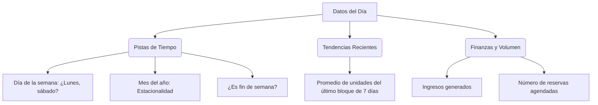
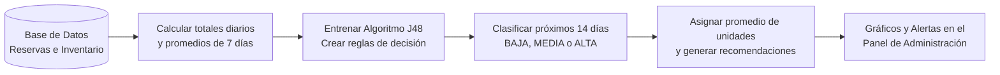

# El Modelo Predictivo de Furent: Guía Sencilla

¡Bienvenido! Este documento explica cómo funciona el sistema de predicciones de **Furent** sin enredos técnicos ni fórmulas matemáticas complejas. Está diseñado para que cualquier persona del equipo o un administrador pueda entender cómo el sistema sabe qué va a pasar en el futuro.

---

## 1. ¿Qué es el Modelo Predictivo y qué resuelve?

En el negocio de alquiler de mobiliario, el mayor reto es la **planificación**:
* ¿Cuántas sillas o mesas se van a necesitar la próxima semana?
* ¿Qué días habrá sobrecarga de entregas y requeriremos más camiones o personal?
* ¿Cuándo deberíamos dar mantenimiento al mobiliario porque la demanda estará baja?

Nuestro modelo predictivo analiza el **historial de reservas pasadas** (habitualmente los últimos 60 días) para **proyectar los siguientes 14 días** en tres áreas:
1. **Unidades de mobiliario** que se alquilarán cada día.
2. **Ingresos económicos** estimados.
3. **Cantidad de reservaciones** individuales que ingresarán.

---

## 2. ¿Cómo funciona? "El Árbol de Decisiones" (Algoritmo J48)

Para predecir cuántos muebles se van a alquilar, el sistema utiliza un algoritmo inteligente llamado **J48** (basado en árboles de decisión). 

> [!TIP]
> **Analogía del Árbol de Decisiones:**
> Imagina que eres el dueño del negocio y tienes que decidir si el próximo sábado será un día de mucho trabajo. Seguramente te harás una serie de preguntas consecutivas:
> 1. *¿Es fin de semana?* 
>    * **No (Lunes a Jueves):** Probablemente sea un día de demanda **BAJA**.
>    * **Sí (Sábado/Domingo):** Pasas a la siguiente pregunta:
> 2. *¿Es temporada de bodas o grados (por ejemplo, Diciembre o Mayo)?*
>    * **Sí:** Entonces la demanda será **ALTA**.
>    * **No:** La demanda será **MEDIA**.
>
> Eso es exactamente lo que hace el algoritmo J48. Crea un mapa (o flujograma) de preguntas lógicas basado en lo que ocurrió en el pasado para clasificar cada día futuro.

### Las Tres Etiquetas de Demanda
El modelo no adivina un número exacto desde el inicio. Primero clasifica los días en tres niveles basados en los registros históricos:
* **BAJA:** Días con muy pocas piezas alquiladas (el 33% de los días con menor actividad).
* **MEDIA:** Días de actividad moderada.
* **ALTA:** Días pico con alquiler masivo de mobiliario (el 33% de los días con mayor actividad, usualmente fines de semana con eventos grandes).

---

## 3. ¿Qué datos utiliza el modelo para aprender? (Los Ingredientes)

Para cada día del pasado y del futuro, el modelo analiza un conjunto de "pistas" o características:

* **Día de la semana y Mes:** Permite aprender la "estacionalidad". Por ejemplo, que los sábados se alquila mucho más que los martes, o que diciembre es un mes más fuerte que febrero.
* **¿Es fin de semana?:** Un indicador clave que separa los eventos corporativos/pequeños de las bodas y fiestas grandes.
* **Promedio Móvil de 7 días:** Mira cómo venía el negocio en la última semana. Si los últimos días han sido muy ocupados, es probable que la inercia continúe.
* **Ingresos y Reservaciones:** Relaciona el dinero facturado y la cantidad de contratos con el volumen físico de muebles.

---

## 4. El Proceso Paso a Paso: De los Datos a la Predicción

El sistema realiza este ciclo de forma automática cada vez que consultas el panel de predicciones:

### Paso 1: Recolección y Preparación
El sistema toma todo el historial de la base de datos. Suma todas las unidades de todos los productos reservados por día. 

### Paso 2: Entrenamiento (El Aprendizaje)
El algoritmo J48 analiza ese historial y construye el árbol de decisiones. Por ejemplo, descubre reglas como:
* *Si es Fin de Semana = Sí AND Promedio Últimos 7 días > 150 unidades → Demanda es **ALTA**.*

### Paso 3: Clasificación del Futuro
Para los próximos 14 días (de los cuales aún no sabemos qué pasará), el sistema evalúa las reglas aprendidas. Mira el calendario y dice: *"El próximo sábado es fin de semana y venimos de una semana activa... por lo tanto, clasifico ese día como demanda **ALTA**"*.

### Paso 4: Traducción a Números Reales
Una vez que el modelo sabe que un día del futuro tendrá demanda **ALTA**, calcula cuántas unidades físicas significa eso. Para hacerlo, mira el promedio de unidades de todos los días clasificados históricamente como **ALTA** y le asigna ese valor aproximado.

---

## 5. Recomendaciones Inteligentes: ¿De qué nos sirve esto?

La pantalla de predicciones no solo muestra gráficos, sino que actúa como un **consultor virtual de tu negocio** generando recomendaciones automáticas:

| Tipo de Alerta | ¿Por qué ocurre? | Acción sugerida por el sistema |
| :--- | :--- | :--- |
| **Alta demanda prevista** | Si el promedio proyectado supera en 20% o más al histórico. | Reforzar personal logístico, alistar camiones y asegurar stock. |
| **Día de Carga Máxima** | Identifica el día exacto con el pico más alto de mobiliario. | Planificar y despachar cargas desde el día anterior. |
| **Oportunidad de Dynamic Pricing** | Detecta días de alta ocupación futura. | Desactivar cupones de descuento generales para maximizar ganancias. |
| **Alerta de Stock de Producto Estrella** | Si tu producto más alquilado tiene inventario bajo. | Comprar o reparar unidades antes de que falte stock. |
| **Demanda Moderada o Baja** | Se prevén semanas muy tranquilas. | Lanzar ofertas/promociones y realizar mantenimiento preventivo. |

---

## 6. Resumen Visual del Flujo de Predicción

Con este sistema, **Furent** no solo registra lo que ya pasó, sino que te da los ojos para ver el futuro del inventario, permitiéndote tomar decisiones operativas y comerciales con total seguridad.
