# 🔄 Furent — Flujo de Reservas (Detallado)

> Documentación exhaustiva del ciclo de vida de una reserva en el sistema Furent.

---

## 📋 Tabla de Contenidos

1. [Visión General](#1-visión-general)
2. [Máquina de Estados](#2-máquina-de-estados)
3. [Flujo Completo Paso a Paso](#3-flujo-completo-paso-a-paso)
4. [Reglas de Negocio](#4-reglas-de-negocio)
5. [Notificaciones por Estado](#5-notificaciones-por-estado)
6. [Métricas y Eventos](#6-métricas-y-eventos)
7. [Historial de Estados](#7-historial-de-estados)
8. [Flujo de Cancelación](#8-flujo-de-cancelación)
9. [Integración con Pagos](#9-integración-con-pagos)
10. [Logística (Entrega y Recogida)](#10-logística-entrega-y-recogida)

---

## 1. Visión General

Una **reserva** en Furent representa el alquiler de uno o más mobiliarios para un evento específico. Cada reserva pasa por un ciclo de vida bien definido con transiciones de estado controladas.

### Entidades Involucradas

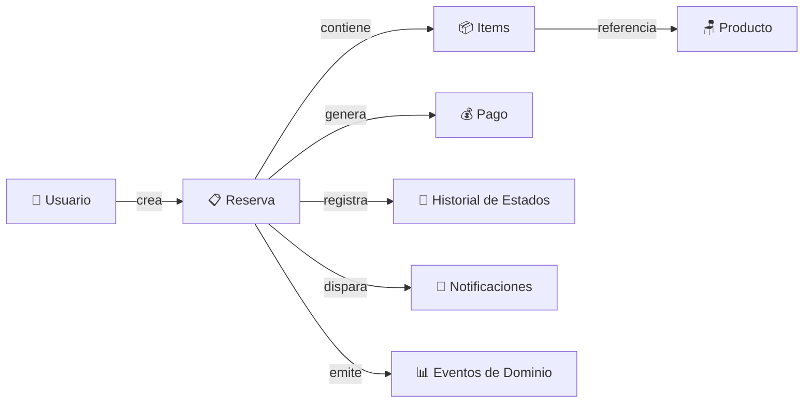

---

## 2. Máquina de Estados

### 2.1 Diagrama de Estados Completo

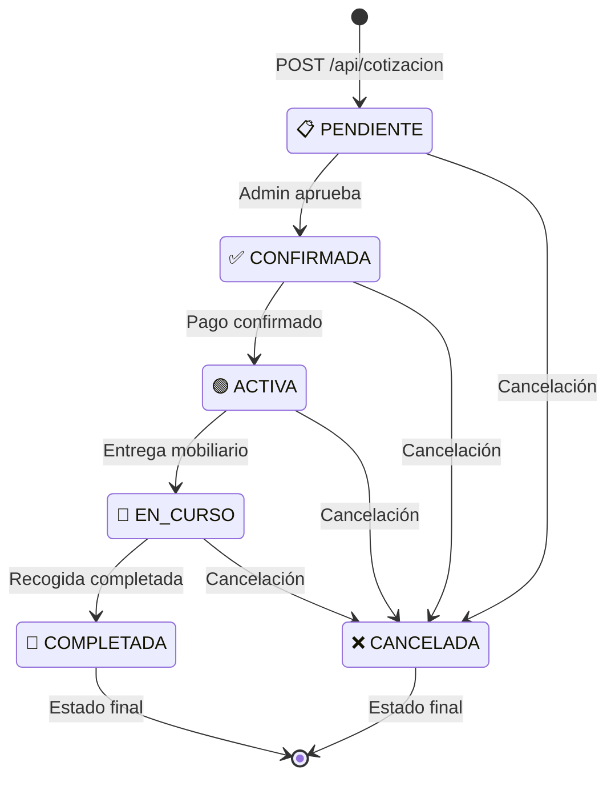

### 2.2 Tabla de Transiciones

```
┌──────────────┬──────────────────────────────────┬─────────────────────┐
│ Estado Actual │ Transiciones Permitidas           │ Disparador          │
├──────────────┼──────────────────────────────────┼─────────────────────┤
│ PENDIENTE    │ → CONFIRMADA                     │ Admin aprueba       │
│              │ → CANCELADA                      │ Usuario/Admin       │
├──────────────┼──────────────────────────────────┼─────────────────────┤
│ CONFIRMADA   │ → ACTIVA                         │ Pago confirmado     │
│              │ → CANCELADA                      │ Usuario/Admin       │
├──────────────┼──────────────────────────────────┼─────────────────────┤
│ ACTIVA       │ → EN_CURSO                       │ Entrega realizada   │
│              │ → CANCELADA                      │ Admin               │
├──────────────┼──────────────────────────────────┼─────────────────────┤
│ EN_CURSO     │ → COMPLETADA                     │ Recogida exitosa    │
│              │ → CANCELADA                      │ Admin               │
├──────────────┼──────────────────────────────────┼─────────────────────┤
│ COMPLETADA   │ (sin transiciones - estado final) │                     │
├──────────────┼──────────────────────────────────┼─────────────────────┤
│ CANCELADA    │ (sin transiciones - estado final) │                     │
└──────────────┴──────────────────────────────────┴─────────────────────┘
```

### 2.3 Mapa de Transiciones (Código)

```java
static final Map<String, Set<String>> TRANSITIONS = Map.of(
    "PENDIENTE",   Set.of("CONFIRMADA", "CANCELADA"),
    "CONFIRMADA",  Set.of("ACTIVA", "CANCELADA"),
    "ACTIVA",      Set.of("EN_CURSO", "CANCELADA"),
    "EN_CURSO",    Set.of("COMPLETADA", "CANCELADA"),
    "COMPLETADA",  Set.of(),
    "CANCELADA",   Set.of()
);
```

---

## 3. Flujo Completo Paso a Paso

### 3.1 Fase 1: Creación (Usuario)

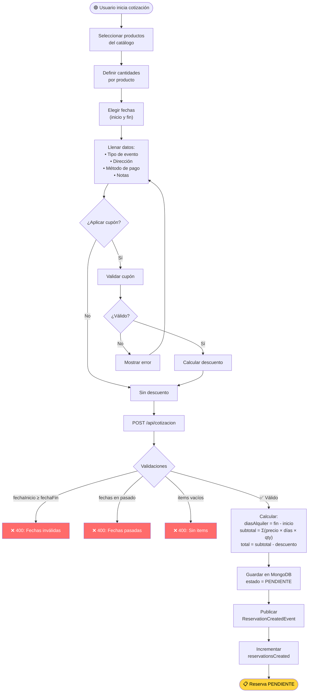

### 3.2 Fase 2: Confirmación (Admin)

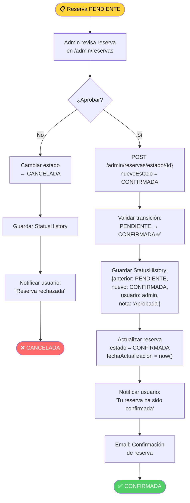

### 3.3 Fase 3: Pago

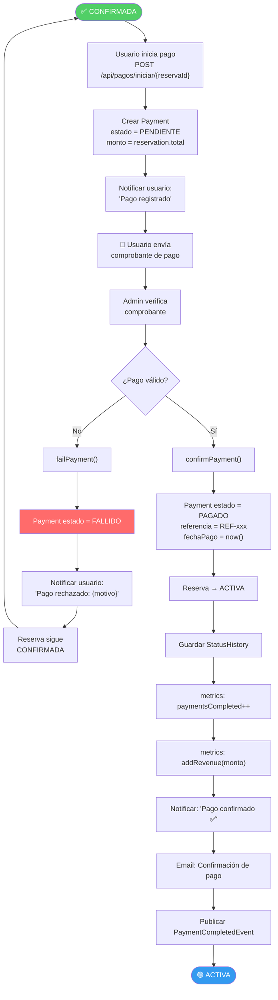

### 3.4 Fase 4: Logística

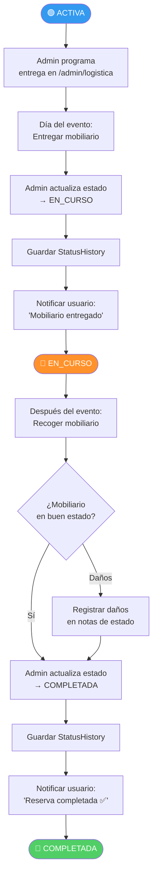

---

## 4. Reglas de Negocio

### 4.1 Validaciones en Creación

| Regla | Descripción | Error |
|:---|:---|:---|
| Fechas válidas | `fechaInicio < fechaFin` | "La fecha de inicio debe ser anterior a la fecha de fin" |
| Fechas futuras | `fechaInicio ≥ hoy` | "Las fechas no pueden ser anteriores a hoy" |
| Items requeridos | `items.size() > 0` | "Debe incluir al menos un producto" |
| Cantidades positivas | `cantidad > 0` por item | "La cantidad debe ser mayor a 0" |

### 4.2 Validaciones en Transición de Estado

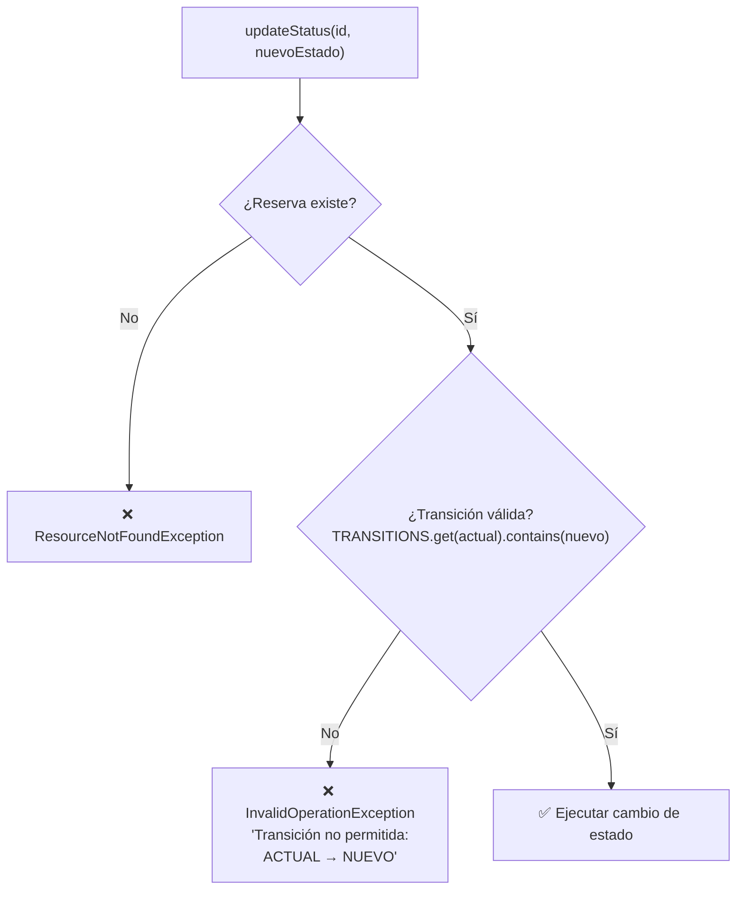

### 4.3 Cálculo de Totales

```
diasAlquiler = fechaFin - fechaInicio (en días)

Por cada item:
  item.subtotal = item.precioPorDia × item.cantidad × diasAlquiler

reservation.subtotal = Σ(item.subtotal)
reservation.total = subtotal - descuentoCupón (si aplica)
```

---

## 5. Notificaciones por Estado

| Transición | Título | Tipo | Mensaje |
|:---|:---|:---|:---|
| → `PENDIENTE` | Cotización Recibida | INFO | "Tu cotización ha sido recibida" |
| → `CONFIRMADA` | Reserva Confirmada | SUCCESS | "Tu reserva ha sido aprobada" |
| → `ACTIVA` | Pago Confirmado | SUCCESS | "Tu pago ha sido confirmado" |
| → `EN_CURSO` | En Curso | INFO | "Tu mobiliario ha sido entregado" |
| → `COMPLETADA` | Completada | SUCCESS | "Tu reserva ha finalizado exitosamente" |
| → `CANCELADA` | Cancelada | ALERT | "Tu reserva ha sido cancelada" |

---

## 6. Métricas y Eventos

### 6.1 Métricas Micrometer

| Evento | Métrica | Tipo |
|:---|:---|:---|
| Reserva creada | `furent.reservations.created` | Counter |
| Reserva cancelada | `furent.reservations.cancelled` | Counter |
| Tiempo creación | `furent.reservation.processing.time` | Timer |

### 6.2 Eventos de Dominio (Spring Events)

```mermaid
graph LR
    RS["ReservationService"] -->|save()| RCE["ReservationCreatedEvent<br/>{reservationId, userId, total}"]
    RS -->|→ CANCELADA| RCAE["ReservationCancelledEvent<br/>{reservationId, reason}"]
    
    RCE --> FL["FurentEventListener"]
    RCAE --> FL
    
    FL --> T1["📊 ReportingService.trackEvent()"]
    FL --> T2["📧 EmailService.sendConfirmation()"]
```

---

## 7. Historial de Estados

Cada cambio de estado genera un registro en `StatusHistory`:

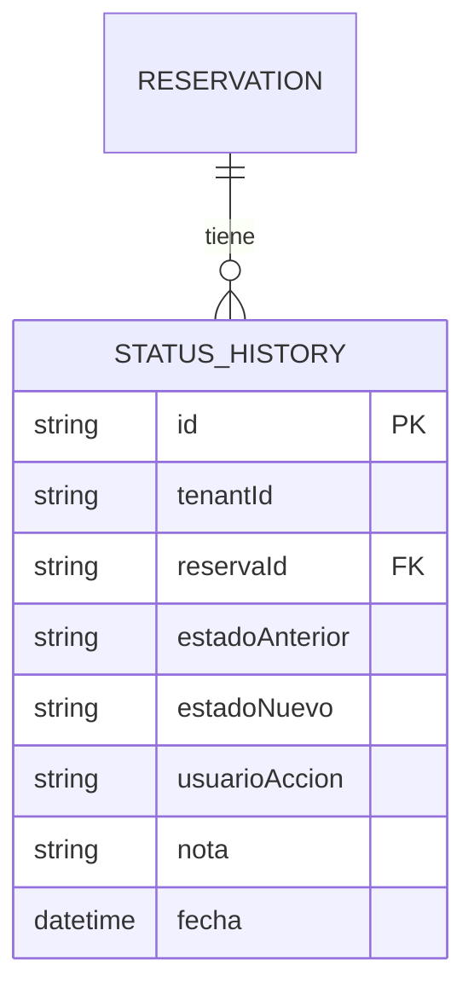

**Ejemplo de historial:**

```
┌─────┬──────────────┬──────────────┬──────────┬──────────────────┐
│  #  │ Anterior     │ Nuevo        │ Usuario  │ Nota             │
├─────┼──────────────┼──────────────┼──────────┼──────────────────┤
│  1  │ -            │ PENDIENTE    │ cliente  │ Cotización nueva │
│  2  │ PENDIENTE    │ CONFIRMADA   │ admin    │ Aprobada         │
│  3  │ CONFIRMADA   │ ACTIVA       │ sistema  │ Pago confirmado  │
│  4  │ ACTIVA       │ EN_CURSO     │ admin    │ Entregado 10am   │
│  5  │ EN_CURSO     │ COMPLETADA   │ admin    │ Recogido 6pm     │
└─────┴──────────────┴──────────────┴──────────┴──────────────────┘
```

---

## 8. Flujo de Cancelación

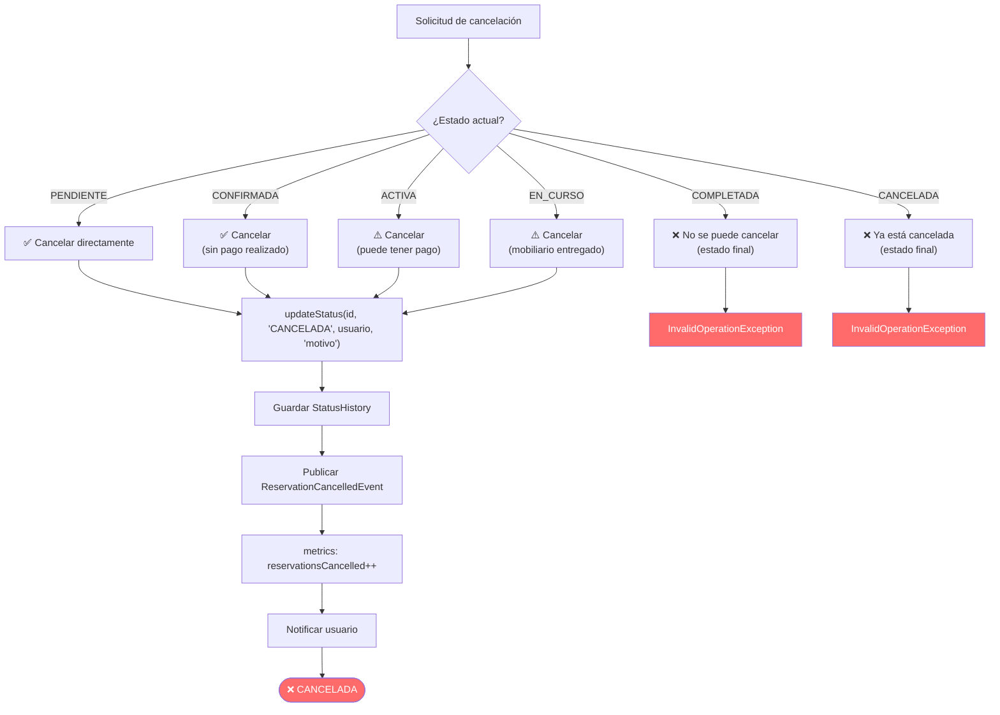

---

## 9. Integración con Pagos

### 9.1 Vínculo Reserva ↔ Pago

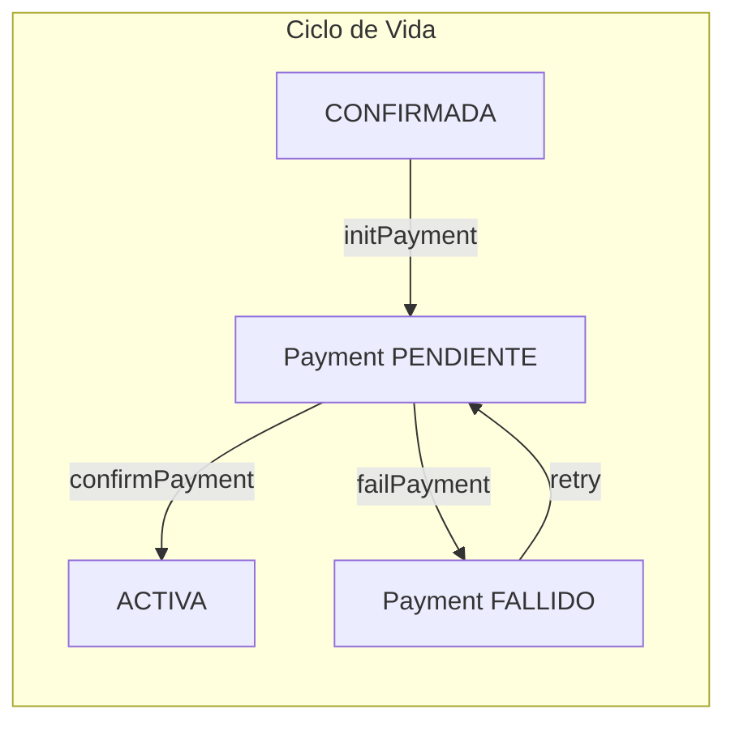

### 9.2 Efecto del Pago en la Reserva

| Acción Pago | Efecto en Reserva |
|:---|:---|
| `initPayment()` | Crea Payment PENDIENTE. Reserva sin cambio |
| `confirmPayment()` | Payment → PAGADO. **Reserva → ACTIVA** |
| `failPayment()` | Payment → FALLIDO. **Reserva sin cambio** (sigue CONFIRMADA) |

---

## 10. Logística (Entrega y Recogida)

### 10.1 Vista del Admin

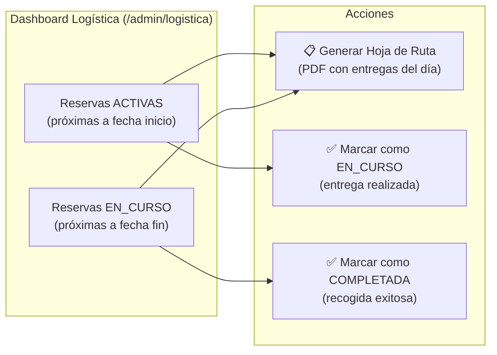

### 10.2 Hoja de Ruta (PDF)

El admin puede descargar un PDF con las entregas/recogidas programadas para el día:

- **GET `/admin/logistica/hoja-ruta`** → PDF generado con OpenHTMLtoPDF
- Incluye: dirección, productos, cantidades, datos del cliente
- Filtra reservas ACTIVAS con `fechaInicio = hoy` y EN_CURSO con `fechaFin = hoy`

---

## Resumen Visual del Ciclo de Vida

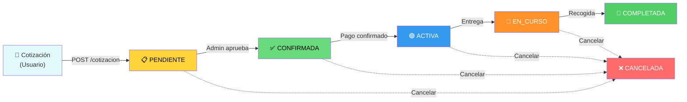

---

> 📝 **Generado automáticamente** — Furent SaaS Platform v1.0  
> Última actualización: Junio 2025
