# 📐 Furent — Diagramas UML

> Diagramas UML detallados del sistema Furent usando notación Mermaid.

---

## 📋 Tabla de Contenidos

1. [Diagrama de Clases Completo](#1-diagrama-de-clases-completo)
2. [Diagrama de Secuencia — Reserva Completa](#2-diagrama-de-secuencia--reserva-completa)
3. [Diagrama de Secuencia — Autenticación](#3-diagrama-de-secuencia--autenticación)
4. [Diagrama de Secuencia — Pago](#4-diagrama-de-secuencia--pago)
5. [Diagrama de Actividad — Crear Cotización](#5-diagrama-de-actividad--crear-cotización)
6. [Diagrama de Actividad — Validar Cupón](#6-diagrama-de-actividad--validar-cupón)
7. [Diagrama de Casos de Uso](#7-diagrama-de-casos-de-uso)
8. [Diagrama de Paquetes](#8-diagrama-de-paquetes)
9. [Diagrama ER (Entidad-Relación)](#9-diagrama-er-entidad-relación)

---

## 1. Diagrama de Clases Completo

### 1.1 Controllers

```mermaid
classDiagram
    class AuthController {
        -UserService userService
        -JwtService jwtService
        -PasswordEncoder passwordEncoder
        -AuditLogService auditLogService
        +login(LoginRequest) AuthResponse
        +register(email, pass, nombre, apellido, tel) AuthResponse
        +refresh(refreshToken) Map
        +logout(Authentication) Map
    }

    class ApiController {
        -ProductService productService
        -UserService userService
        -CouponService couponService
        -NotificationService notificationService
        -ReservationService reservationService
        -PaymentService paymentService
        +searchProducts(keyword) List~Product~
        +addFavorite(productoId, auth) ResponseEntity
        +removeFavorite(productoId, auth)
        +validateCoupon(codigo, monto) Map
        +getNotifications(auth) List~Notification~
        +markAsRead(id) ResponseEntity
        +markAllAsRead(auth) ResponseEntity
        +createCotizacion(CotizacionRequest, auth) ResponseEntity
    }

    class PaymentController {
        -PaymentService paymentService
        +initPayment(reservaId, auth) ResponseEntity
        +getPaymentByReserva(reservaId) ResponseEntity
        +getMyPayments(auth) ResponseEntity
    }

    class PageController {
        -ProductService productService
        -CategoryRepository categoryRepository
        -ReservationService reservationService
        -ReviewService reviewService
        -UserService userService
        -ContactService contactService
        +index(Model) String
        +catalog(category, page, search, Model) String
        +productDetail(id, Model) String
        +cart() String
        +login() String
        +register() String
        +panel(auth, Model) String
        +contact() String
        +submitContact(ContactMessage) String
    }

    class ReviewController {
        -ReviewService reviewService
        +submitReview(productId, rating, comment, auth) String
    }
```

### 1.2 Admin Controllers

```mermaid
classDiagram
    class AdminDashboardController {
        -ReservationService reservationService
        -ProductService productService
        -UserService userService
        -PaymentService paymentService
        -AuditLogService auditLogService
        +dashboard(Model) String
        +logistica(Model) String
    }

    class AdminReservasController {
        -ReservationService reservationService
        -PdfService pdfService
        -NotificationService notificationService
        +reservas(Model) String
        +changeStatus(id, estado, nota, auth) String
        +downloadContract(id) ResponseEntity
        +downloadRoadmap() ResponseEntity
    }

    class AdminProductosController {
        -ProductService productService
        -CategoryRepository categoryRepository
        +mobiliarios(Model) String
        +saveProduct(Product, MultipartFile) String
    }

    class AdminCuponesController {
        -CouponService couponService
        +cupones(Model) String
        +saveCoupon(Coupon) String
        +deleteCoupon(id) String
    }

    class AdminPagosController {
        -PaymentService paymentService
        -ReservationService reservationService
        +getAllPayments() List~Payment~
        +confirmPayment(id, auth) ResponseEntity
    }

    class AdminMensajesController {
        -ContactService contactService
        +mensajes(Model) String
        +markAsRead(id) String
        +deleteMessage(id) String
    }

    class AdminExportController {
        -ExportService exportService
        -ProductService productService
        -ReservationService reservationService
        -UserService userService
        +exportProducts() ResponseEntity~byte[]~
        +exportReservations() ResponseEntity~byte[]~
        +exportUsers() ResponseEntity~byte[]~
    }
```

### 1.3 Services

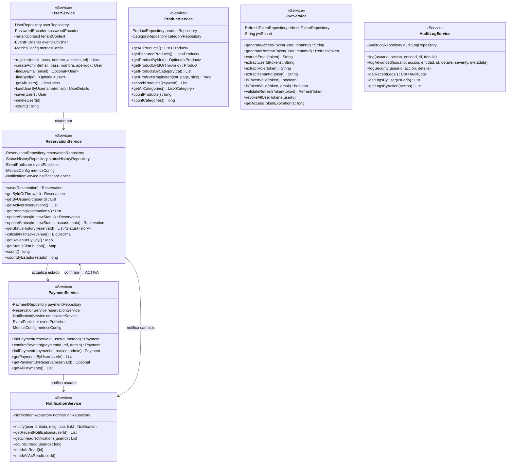

### 1.4 Domain Models

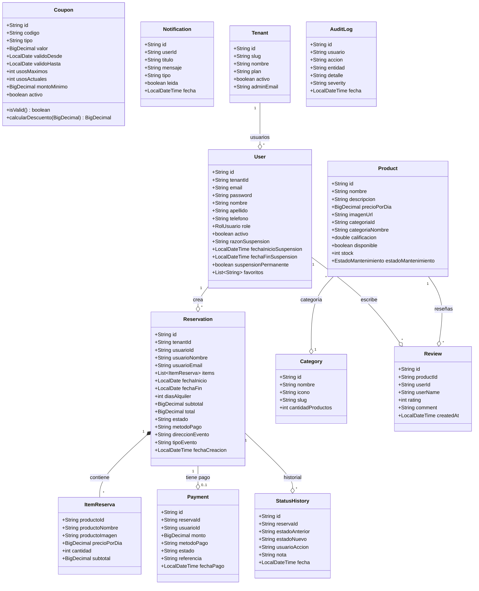

### 1.5 Enumeraciones

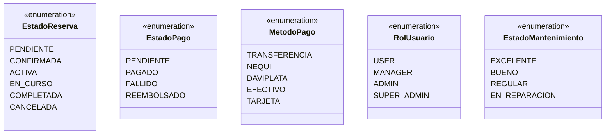

---

## 2. Diagrama de Secuencia — Reserva Completa

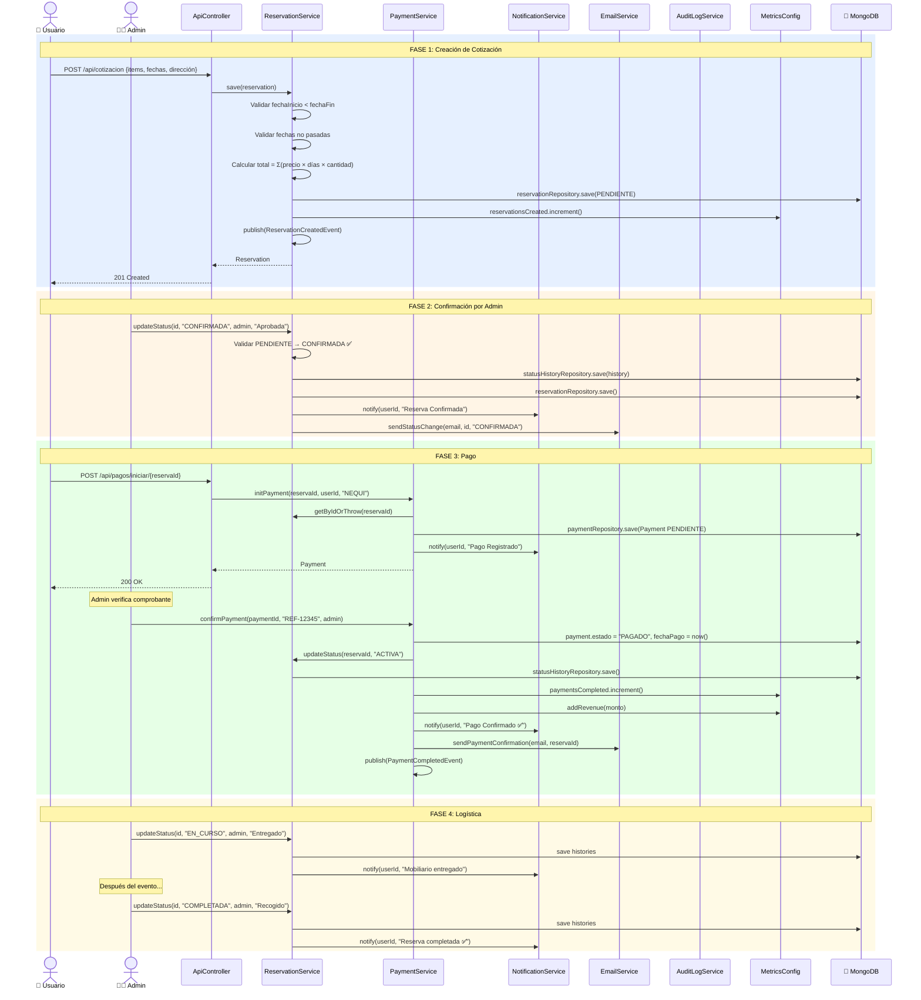

---

## 3. Diagrama de Secuencia — Autenticación

### 3.1 Registro

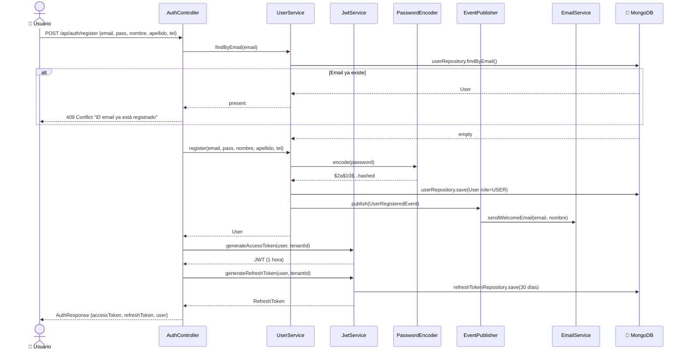

### 3.2 Login

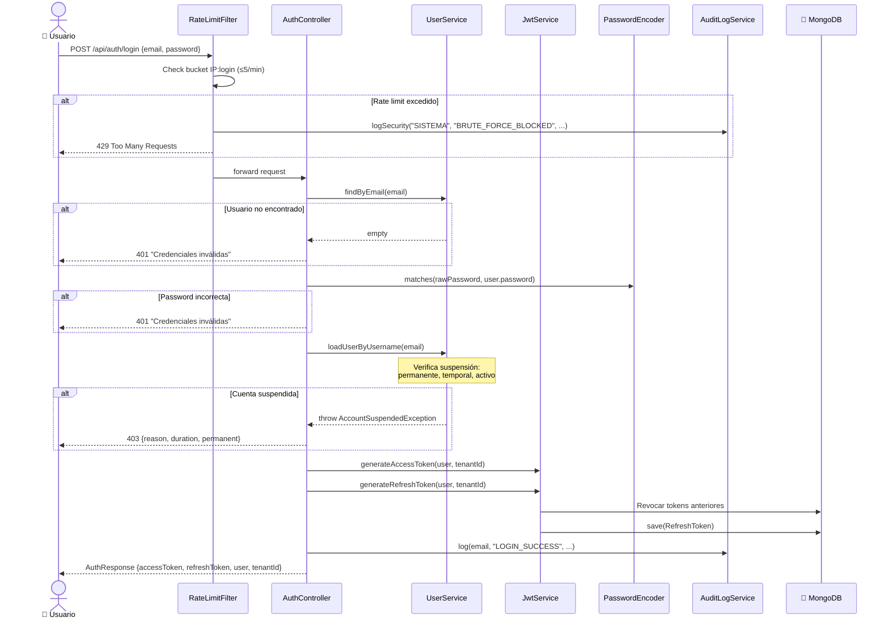

---

## 4. Diagrama de Secuencia — Pago

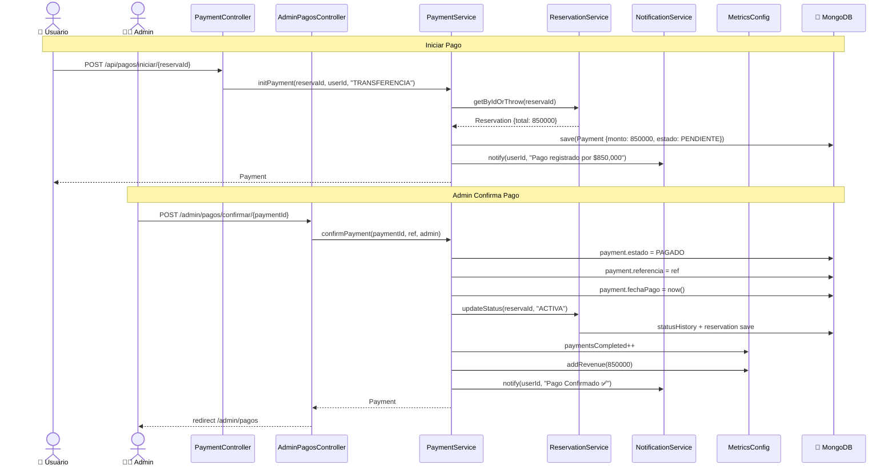

---

## 5. Diagrama de Actividad — Crear Cotización

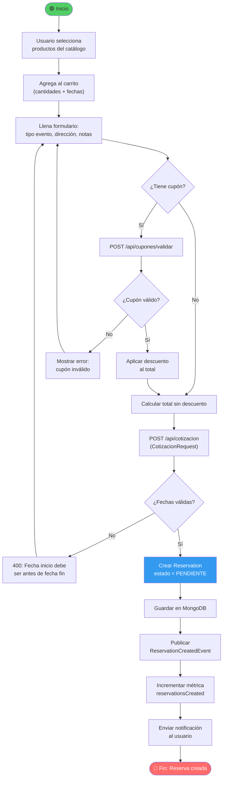

---

## 6. Diagrama de Actividad — Validar Cupón

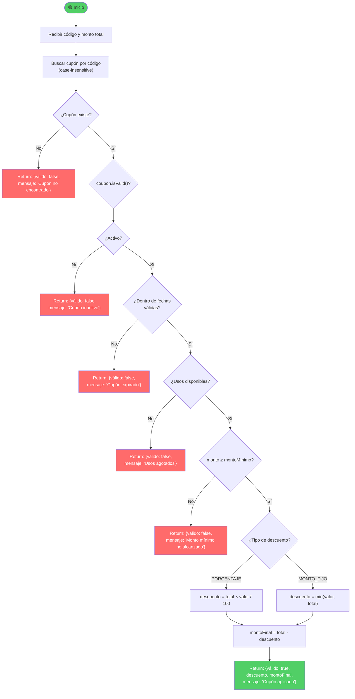

---

## 7. Diagrama de Casos de Uso

```mermaid
graph TB
    subgraph "Sistema Furent"
        subgraph "Públicas"
            UC1["Ver catálogo de<br/>mobiliarios"]
            UC2["Buscar productos"]
            UC3["Ver detalle de<br/>producto"]
            UC4["Registrarse"]
            UC5["Iniciar sesión"]
            UC6["Enviar mensaje<br/>de contacto"]
        end
        
        subgraph "Usuario Autenticado"
            UC7["Crear cotización /<br/>reserva"]
            UC8["Ver mis reservas"]
            UC9["Iniciar pago"]
            UC10["Validar cupón"]
            UC11["Agregar a favoritos"]
            UC12["Escribir reseña"]
            UC13["Ver notificaciones"]
            UC14["Marcar notificación<br/>como leída"]
            UC15["Cerrar sesión"]
            UC16["Recuperar contraseña"]
        end
        
        subgraph "Administrador"
            UC17["Ver dashboard KPIs"]
            UC18["Gestionar productos"]
            UC19["Confirmar/rechazar<br/>reservas"]
            UC20["Confirmar pagos"]
            UC21["Gestionar cupones"]
            UC22["Ver mensajes<br/>de contacto"]
            UC23["Exportar datos CSV"]
            UC24["Generar PDF contrato"]
            UC25["Ver hoja de ruta<br/>(logística)"]
            UC26["Ver logs de auditoría"]
        end
    end

    User["👤 Usuario"]
    Admin["👨‍💼 Admin"]

    User --> UC1 & UC2 & UC3 & UC4 & UC5 & UC6
    User --> UC7 & UC8 & UC9 & UC10 & UC11 & UC12 & UC13 & UC14 & UC15 & UC16
    Admin --> UC17 & UC18 & UC19 & UC20 & UC21 & UC22 & UC23 & UC24 & UC25 & UC26
```

---

## 8. Diagrama de Paquetes

```mermaid
graph TB
    subgraph "com.alquiler.furent"
        subgraph "controller"
            C1["AuthController"]
            C2["ApiController"]
            C3["PaymentController"]
            C4["PageController"]
            C5["ReviewController"]
            subgraph "controller.admin"
                CA1["AdminDashboardController"]
                CA2["AdminReservasController"]
                CA3["AdminProductosController"]
                CA4["AdminCuponesController"]
                CA5["AdminPagosController"]
                CA6["AdminMensajesController"]
                CA7["AdminExportController"]
                CA8["AdminModelAdvice"]
            end
        end

        subgraph "service"
            S1["UserService"]
            S2["ReservationService"]
            S3["PaymentService"]
            S4["ProductService"]
            S5["CouponService"]
            S6["NotificationService"]
            S7["ReviewService"]
            S8["JwtService"]
            S9["AuditLogService"]
            S10["ContactService"]
            S11["EmailService"]
            S12["PasswordResetService"]
            S13["PdfService"]
            S14["ExportService"]
            S15["TenantService"]
            S16["ReportingService"]
        end

        subgraph "model"
            M1["User"]
            M2["Reservation"]
            M3["Payment"]
            M4["Product"]
            M5["Category"]
            M6["Review"]
            M7["Coupon"]
            M8["Notification"]
            M9["AuditLog"]
            M10["Tenant"]
            M11["Email VO"]
            M12["Money VO"]
        end

        subgraph "repository"
            R1["18 MongoRepository<br/>interfaces"]
        end

        subgraph "config"
            CF1["SecurityConfig"]
            CF2["JwtAuthFilter"]
            CF3["RateLimitFilter"]
            CF4["TenantFilter"]
            CF5["CacheConfig"]
            CF6["MetricsConfig"]
        end

        subgraph "exception"
            EX1["ResourceNotFoundException"]
            EX2["ApiExceptionHandler"]
            EX3["GlobalExceptionHandler"]
        end

        subgraph "event"
            EV1["7 Domain Events"]
            EV2["EventPublisher"]
            EV3["FurentEventListener"]
        end

        subgraph "dto"
            D1["AuthResponse"]
            D2["CotizacionRequest"]
            D3["ProductResponse"]
            D4["ReservationResponse"]
        end
    end

    controller --> service
    service --> repository
    service --> model
    repository --> model
    controller --> dto
    service --> event
    config --> service
```

---

## 9. Diagrama ER (Entidad-Relación)

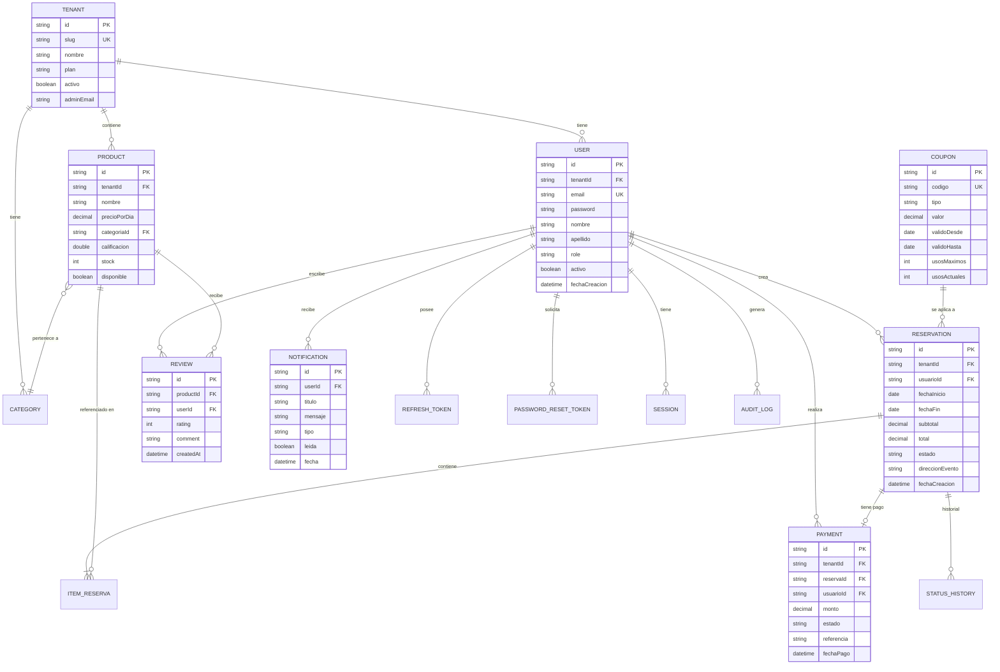

---

> 📝 **Generado automáticamente** — Furent SaaS Platform v1.0  
> Todos los diagramas usan notación **Mermaid** — renderizables en GitHub, GitLab, VS Code y cualquier visor Markdown compatible.
